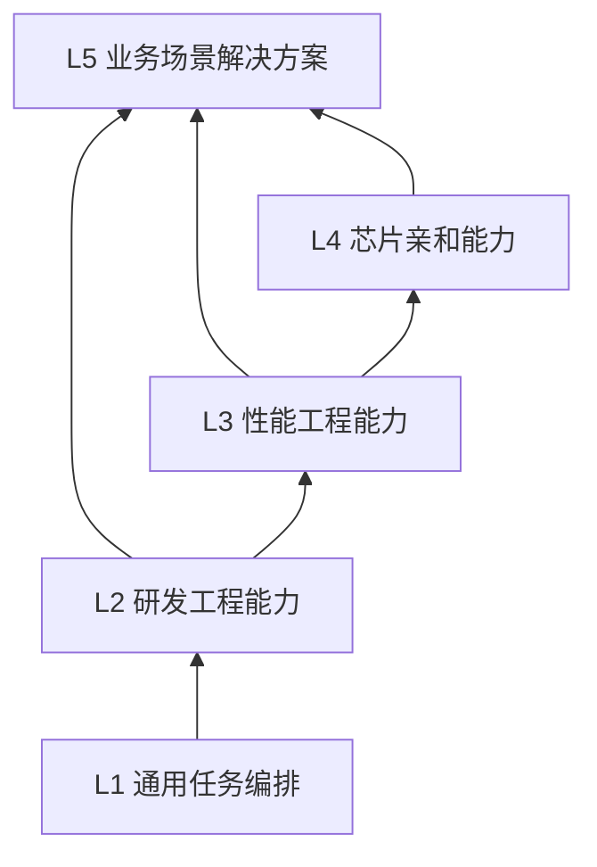

# 分层复用 SKILL 能力库：调查结论与落地建议

> 调查日期：2026-08-17；方案刷新：2026-08-20
>
> 目标：构建分层复用、跨 Agent 可用、可治理和可持续演进的 SKILL 能力库，优先沉淀高价值业务场景能力。

## 一、结论先行

建议把能力库建设成一个“以 Git 为事实源、以静态站点为目录、以 Profile 为组合与粗粒度路由单位、以 `hwskill` 和 Agent 适配器为运行桥梁”的内部产品，而不是在“代码仓、网站、Wiki”中三选一。

| 问题 | 建议结论 |
|---|---|
| 能力库的主形态 | **Git monorepo 是唯一事实源**，保存技能源码、测试、依赖、版本、来源和审计记录。 |
| 网站的作用 | 由仓库元数据自动生成，只负责搜索、筛选、质量展示、安装指引和使用反馈，不作为编辑源。 |
| Wiki 的作用 | 只保存治理制度、FAQ、设计决策和培训材料；技能正文不能只存在 Wiki。 |
| 组合与分发单位 | 单个 Skill 用于细粒度复用；**Profile** 携带场景描述、Skill 集合和依赖/冲突规则；Plugin/Extension 用于同时交付 Skills、Hooks、MCP、Role Agents 等复合能力。 |
| 跨 Agent 方案 | 使用 Agent Skills 开放格式作为“可移植核心”，厂商特性放在 adapter/overlay 中，不维护多份完整正文。 |
| 默认运行模式 | 普通用户安装 `hwskill` 和对应 Agent adapter，默认使用虚拟 Catalog 与按需 Loader；仅在宿主不支持动态发现或用户明确需要原生体验时，才将 Skill 安装到原生目录。 |
| 是否全量拉取 | 中央源可由 `hwskill` 管理在 `~/.hwskills/registry/`；全库存储不等于全量暴露给模型，用户不需要把全部 Skill 复制到各 Agent 的原生目录。 |
| 是否进入业务代码库 | 项目事实、项目专属工作流和 L5 场景 Skill 应随业务代码版本化；通用 L1-L4 不复制进业务库，只提交候选 Profile Set、lockfile 和必要适配配置。 |
| 如何精准激活 | 项目先限定候选 Profile Set；系统按权限、Agent、OS/arch、语言和路径过滤；模型根据 Profile `description` 选择零到多个 Profile，再根据 Skill `description` 选择具体能力。 |
| 大库是否影响上下文 | 全库的存储体积不会自动进入上下文，但**已暴露 Profile/Skill 的 name/description 会占用上下文并争夺注意力**。所以“Registry 存储”、“当前可见目录”和“已加载正文”必须分离。 |
| L1-L5 是否保留 | 保留为“能力抽象轴”，但不能充当唯一目录模型；还需增加作用域/所有权轴、运行载体轴，并用依赖 DAG 组合。 |

一句话架构：**库很大，项目候选 Profile Set 有边界；Profile 做粗粒度路由，Skill 做细粒度执行；源码只有一份，Agent 适配可生成；能力按 DAG 复用，质量按场景 Eval 说话。**

## 二、业界现状与可借鉴实践

### 2.1 `SKILL.md` 已形成跨 Agent 的最小公约

[Agent Skills 开放规范](https://agentskills.io/specification)将 Skill 定义为一个包含 `SKILL.md` 的目录，要求至少有 `name` 和 `description`，可附带 `scripts/`、`references/`、`assets/`。其核心机制是三级渐进加载：启动时只加载元数据，命中后加载完整指令，资源文件按需读取。规范建议主 `SKILL.md` 小于 500 行、激活后的指令小于约 5,000 tokens，并避免深层引用链。

这意味着可以把绝大多数跨 Agent 能力放在同一份标准核心中，但它只统一了“包内格式”，**没有统一安装目录、优先级、插件结构、Hooks、Subagents、权限模型和显式调用语法**。这些差异必须由交付工具处理。

### 2.2 主流 Agent 的能力边界

| Agent/产品 | 原生发现与作用域 | 激活方式 | 分发与扩展 | 对能力库的启示 |
|---|---|---|---|---|
| OpenAI Codex | Repo、User、Admin、System 多级；Repo/User 主要使用 `.agents/skills` | 根据 `description` 隐式激活，也可用 `$skill` 显式调用 | Plugin 可打包 Skills、MCP、Hooks；custom agent 可配置指令、模型、sandbox、MCP 和 `skills.config` | 可用 Plugin + Tool + Hook 实现虚拟 Catalog；custom agent 主要是 spawned session，`/agent` 是 Agent 线程导航，不应当成原地改写主会话角色。 |
| Claude Code | Enterprise、Personal、Project、Plugin；主要使用 `.claude/skills`，并支持嵌套目录 | 自动匹配或 `/skill-name`；Hook 可在 Session/Prompt/Tool 事件注入上下文 | Plugin Marketplace 可分发 Skills、Hooks、MCP 和 Agents；`@agent` 可单任务委派，`--agent` 可启动整会话角色 | 适合 Plugin + Hook 适配；Agent 的 `skills` 字段会预加载完整正文，只宜放少量强制核心。 |
| GitHub Copilot | CLI 的 Project 支持 `.github/skills`、`.claude/skills`、`.agents/skills`，Personal 支持 `~/.copilot/skills`、`~/.agents/skills` | 自动匹配或 `/skill`；CLI 支持 `/skills reload/info/list/add/remove` 和 `copilot skill` | Plugin 可打包 Skills、Agents、Hooks、MCP；CLI 与 cloud coding agent 的配置来源不同 | CLI 可做 Plugin + MCP 深适配；cloud 必须使用仓库内声明式配置，不能假定能读取用户机器的 `~/.hwskills`。 |
| Cursor | 支持 `.agents/skills`、`.cursor/skills`，并兼容 Claude/Codex 目录 | 自动匹配或 `/skill-name`；支持 `paths`，Skill 正文附着到单条消息 | Cursor Plugin 可组合 Skills、Agents、Hooks、Rules 和 MCP；`workspaceOpen` Hook 可返回动态 Plugin 路径 | `paths` 适合确定性裁剪；`workspaceOpen + sessionStart + MCP` 可承载虚拟 Catalog；Role 用 Custom Mode 或独立 Subagent。 |
| Gemini CLI | Built-in、Extension、User、Workspace；支持 `.gemini/skills` 和 `.agents/skills` | 自动激活；CLI 可 list/reload/enable/disable/link | Extension 可打包 Skills、MCP、Hooks 和预览状态的 Agents；远程安装和 Skill 激活均有确认机制 | `SessionStart + BeforeAgent + MCP` 可分别承担会话候选集和任务 overlay；安全授权不能只靠 Skill 文本。 |
| DeepSeek Harness (`dsh`) | `ctx.skills` 是 host + per-scope 分层 Registry；Provider 可来自文件系统、插件内嵌、HTTP 或其他后端，并按 session cwd 生成快照 | 只先发布 Skill `name + description`；模型通过 `skill(name)` 加载正文，用户可用 `/name` 显式注入 | 基于 Cordis 的“一切皆插件”；Profile/Bundle 组合模型、工具、Skill、会话、沙箱、Loop、UI 等能力 | 与虚拟 Catalog + Loader 最契合，优先实现 `hwskill` Skill Provider Plugin；但仍是 Developer Preview，必须 pin 版本并做兼容 Eval。 |
| OpenCode V2 | 除项目/用户目录外，`skills` 配置可直接引用本地目录或 HTTP Catalog；每次只发布 Skill 元数据，正文由 `skill` tool 加载 | Plugin 可 `skill.transform/reload`，并在模型调度前修改 `system/messages/tools` | 同时支持 primary agent 与 subagent；primary 可在会话中切换 | HTTP Catalog 与动态 Plugin 都与 Registry 高度匹配，但 V2 Plugin API 是 beta，必须 pin 版本并兼容测试。 |
| Pi | 用户/项目 `.pi/skills`、`.agents/skills`、Package 和 settings 路径；元数据进系统提示，正文由 `read` 按需加载 | Extension 的 `resources_discover` 可按 cwd 增加 Skill 路径，`before_agent_start` 可逐任务注入或修改 system prompt | Pi Package 可分发 Extension + Skills；核心默认不内置 Subagent/Plan | 可做接近原生的动态 Adapter；Role 需由扩展/新会话实现，不能宣称 Pi 核心已提供统一主角色切换。 |
| oh-my-pi | `.omp` 原生源并兼容 Claude/Codex/Agents/OpenCode/GitHub providers；元数据进提示，正文通过 `skill://` 按需读取 | Plugin/Extension/Tool 可接入 Catalog，内置 source toggle、include/ignore 和 provider 优先级 | Agent Hub 可 focus/steer/revive 子 Agent；OMP 自身 `--profile` 会整体迁移用户配置根 | 适合 Plugin + Tool；当前 `resources_discover` 虽有类型但无 Session 调用点，不应依赖；Role 用子 Agent，OMP Profile 与 `hwskill Profile` 必须隔离命名。 |

来源：[Codex Skills](https://developers.openai.com/codex/skills/)、[Codex Plugins](https://developers.openai.com/plugins/build/plugins)、[Codex Hooks](https://learn.chatgpt.com/docs/hooks)、[Codex Subagents](https://learn.chatgpt.com/docs/agent-configuration/subagents)、[Claude Code Skills](https://code.claude.com/docs/en/slash-commands)、[Claude Code Plugins](https://code.claude.com/docs/en/plugins)、[Claude Code Hooks](https://code.claude.com/docs/en/hooks)、[Claude Code Subagents](https://code.claude.com/docs/en/sub-agents)、[GitHub Copilot Agent Skills](https://docs.github.com/en/copilot/how-tos/copilot-cli/customize-copilot/add-skills)、[GitHub Copilot Plugins](https://docs.github.com/en/copilot/concepts/agents/about-plugins)、[GitHub Copilot Hooks](https://docs.github.com/en/copilot/reference/hooks-reference)、[Cursor Agent Skills](https://prod.cursor.com/docs/skills)、[Cursor Plugins](https://prod.cursor.com/docs/plugins)、[Cursor Hooks](https://prod.cursor.com/docs/hooks)、[DeepSeek Harness](https://github.com/deepseek-ai/deepseek-harness)、[DeepSeek Harness Architecture](https://github.com/deepseek-ai/deepseek-harness/blob/master/docs/architecture.md)、[DeepSeek Harness Skill Registry](https://github.com/deepseek-ai/deepseek-harness/blob/master/packages/skill/skill/README.md)、[DeepSeek Harness Skill Tool](https://github.com/deepseek-ai/deepseek-harness/blob/master/packages/skill/tool-skill/README.md)、[OpenCode Skills](https://opencode.ai/v2/docs/skills)、[OpenCode Plugins](https://opencode.ai/v2/docs/build/plugins)、[OpenCode Agents](https://opencode.ai/docs/agents)、[Pi Skills](https://github.com/earendil-works/pi/blob/main/packages/coding-agent/docs/skills.md)、[Pi Extensions](https://github.com/earendil-works/pi/blob/main/packages/coding-agent/docs/extensions.md)、[Pi Packages](https://github.com/earendil-works/pi/blob/main/packages/coding-agent/docs/packages.md)、[oh-my-pi Skills](https://github.com/can1357/oh-my-pi/blob/main/docs/skills.md)、[oh-my-pi Extensions](https://github.com/can1357/oh-my-pi/blob/main/docs/extensions.md)、[oh-my-pi Marketplace](https://github.com/can1357/oh-my-pi/blob/main/docs/marketplace.md)、[oh-my-pi Agent Hub](https://github.com/can1357/oh-my-pi/blob/main/docs/agent-hub.md)、[Gemini CLI Skills](https://github.com/google-gemini/gemini-cli/blob/main/docs/cli/using-agent-skills.md)、[Gemini CLI Extensions](https://github.com/google-gemini/gemini-cli/blob/main/docs/extensions/reference.md)、[Gemini CLI Hooks](https://github.com/google-gemini/gemini-cli/blob/main/docs/hooks/reference.md)、[Gemini CLI Subagents](https://github.com/google-gemini/gemini-cli/blob/main/docs/core/subagents.md)。

### 2.3 DeepSeek Harness 对能力库设计的验证与修正

[DeepSeek Harness](https://github.com/deepseek-ai/deepseek-harness)（`dsh`）是 DeepSeek AI 官方开源的 Agent Harness，而不是一种模型或单纯的 API Wrapper。官方将关系概括为 `Agent = Model + Harness`：模型负责推理，Harness 负责环境理解、工具执行、Skill、会话、沙箱、存储、Agent Loop、调度和 UI。它当前处于 **Developer Preview**，官方明确提示会发生破坏兼容性的变更，因此适合进入实验性 Adapter 和架构验证，不应成为首版唯一宿主或唯一分发路径。

其基于 Cordis 的核心思想是“一切皆插件”：没有必须修改的特权核心，模型适配、工具 Registry、Skill Registry、Session Log 和 Agent Loop 都由插件注册服务、事件和可逆副作用。运行时 `Profile` 是 Harness Home 中的命名组合，按顺序叠加 Bundle、外部插件和 `cordis.patch.yml`；`web`、`headless` 是内置模板。这里存在重要的同名概念，必须在产品和 Schema 中显式区分：

| 名称 | 语义 | 在本方案中的映射 |
|---|---|---|
| `hwskill Profile` | 带领域描述、Skill 集合、依赖和冲突规则的业务能力组合 | Available Profile Set 和 Task Profile Selection 的输入 |
| `dsh Profile` | Harness 启动时的 Bundle、Plugin 和 Patch 组合 | 宿主运行时分发/部署组合，不参与业务 Skill 路由 |
| `dsh Agent preset` | 给单个 Agent 组合不同模型、工具、作用域和持续能力 | 接近 Role Agent 的运行视图，但仍需独立 Role Prompt、权限与 handoff 契约 |

DeepSeek Harness 的 Skill 数据流与本文提出的虚拟 Catalog 高度一致：`ctx.skills` 允许文件系统、嵌入插件、HTTP 或自定义 Provider 注册 Skill；`dsh-tool-skill` 在 `agent/pre-step` 按会话 cwd 获取快照，只把排序后的 `name + description` 作为可持久追踪的 Catalog 暴露给模型；模型命中后调用 `skill(name)`，正文以工具结果进入下一步；用户也可以通过 `/name` 确定性注入。由此，`hwskill` 最佳接入方式不是把 Skill 全量复制到 DSH 原生目录，而是实现一个 Cordis Skill Provider：

```text
cwd + Organization/Project/User bindings
    → hwskill Resolver
    → dsh-hwskill-provider（ctx.skills.registerProvider）
    → dsh-tool-skill（Catalog + skill(name) + /name）
    → DeepSeek/其他模型
```

这个实现也暴露了通用方案必须补强的边界：当前 DSH Catalog 只包含 `name + description`，不包含来源、Provider 和 `whenToUse`；description 默认截断长度上限为 500；正文没有大小上限；一个条目变化会追加完整替换 Catalog；仅修改正文不会改变 Catalog digest，也不会通知模型旧正文已过期。因此 `hwskill` 仍需负责来源、版本、checksum、权限和 token 预算，向 description 前置必要的触发/排除边界，并让每个任务的 Effective Skill Catalog 尽量稳定。DSH Adapter 还必须 pin 已验证版本，对 Skill Provider API、Catalog 生命周期、显式调用和 Session 恢复执行兼容 Eval。

DeepSeek Harness 是新增的目标宿主和有价值的参考实现，**不替代** Codex、Claude Code、Cursor、Gemini CLI、OpenCode、Pi、oh-my-pi 等现有 Adapter。团队仍可能因为 IDE、权限模型、企业管理、模型接入和工作习惯选择不同宿主；统一的是 `hwskill` Registry/Profile/Resolver 契约，差异继续封装在宿主 Adapter 中。

### 2.4 Skill 不是所有扩展问题的答案

建议先按下面的边界选择载体：

| 需求 | 最合适的载体 |
|---|---|
| 每次任务都必须遵守的项目事实、命令、禁令 | `AGENTS.md`、`CLAUDE.md`、Rules 或项目配置 |
| 特定任务才需要的知识、流程、模板 | Skill |
| 必须确定执行的校验、审计或拦截 | Hook、CI、Policy-as-code；不要只写成提示词 |
| 查询实时数据或操作外部系统 | MCP/Connector/Tool |
| 需要独立上下文、特定工具或并行工作 | Subagent/Custom Agent |
| 同时交付 Skills、Hooks、MCP、Agent、资产 | Plugin/Extension |
| 面向岗位或场景的一组选择 | 能力库自定义的 Profile；它是组合与粗粒度路由层，不冒充开放规范字段 |

`AGENTS.md`、`CLAUDE.md` 或 Rules 中可以写“何时调用 `hwskill`”的项目路由指令，但它们是 always-on 上下文，不会自动把任意外部目录变成宿主的原生 Skill registry，也不能代替 Catalog/Loader 协议。

### 2.5 对提案中 L1 开源候选的判断

这些项目有价值，但不应全部作为默认能力同时启用：

| 候选 | 可吸收内容 | 风险与建议定位 |
|---|---|---|
| [obra/superpowers](https://github.com/obra/superpowers) | 设计澄清、计划、TDD、系统调试、验证、Review 等可组合流程；适配多种 Agent | 它是完整且强约束的方法论，应作为一个**可选编排内核 Profile**，或只引入经验证的子集。 |
| [garrytan/gstack](https://github.com/garrytan/gstack) | 角色化 Review、QA、浏览器验证、发布等端到端实践 | 与 Agent、浏览器和发布流程耦合更深，适合作为独立 Plugin/Profile 试点，不宜拆散后与另一套编排框架默认叠加。 |
| [planning-with-files](https://github.com/soucod/planning-with-files-skill) | 用文件保存计划、发现和进度，解决长任务恢复和 context compaction 后续跑 | 与 Agent 原生 Plan、Goal、Memory、Hook 能力可能重叠；应按运行环境检测后启用，而不是 L1 强制依赖。其作者公布的效果是内部自测结果，不能代替本组织 Eval。 |
| [andrej-karpathy-skills](https://github.com/swarmclawai/andrej-karpathy-skills) | 一份原则生成多 Agent 配置的 adapter 思路 | 属于社区整理的 “Karpathy-inspired” 内容，不是公司规范或正式工程标准；可作为提示词简洁性和 adapter 结构参考，不应因名人归因直接进入稳定层。 |
| [oh-my-codex](https://github.com/materialofair/oh-my-codex) | 多上游 manifest、allowlist、冲突分析、同步保护、路由和治理工具 | 适合借鉴治理与合并机制；“一次激活大量 Skill/MCP/Rule”不适合作为企业默认安装策略。 |

还可借鉴两类基础设施实践：一是 [Vercel `skills` CLI](https://github.com/vercel-labs/skills) 对多 Agent 路径、按 Skill 选择、全局/项目作用域和 symlink/copy 的抽象；二是 GitHub `gh skill` 的 preview、provenance、pin 和 publish validate，以及 Copilot CLI 当前 `copilot skill`/`/skills` 的宿主管理体验。生产环境仍应实现或封装为公司自己的 `hwskill`，以支持内网代码托管、权限、签名和审批。

## 三、对 L1-L5 模型的修正

### 3.1 保留五层，但把它定义为“抽象程度”而不是“目录继承”



图中的箭头表示“可依赖”，不表示上层可以随意覆盖下层。实际组合是 DAG，例如 `cpython-kunpeng-perf` 可以依赖 `python-debugging`、`perf-baseline`、`numa-cache-diagnosis`，但不必继承全部 L2-L4。

建议的层级准入边界：

| 层级 | 允许承载 | 不应承载 | 主要验收证据 |
|---|---|---|---|
| L1 通用任务编排 | 澄清、规划、证据收集、验证、Review、长任务恢复等与语言/硬件无关的工作流 | 同时安装多套互斥方法论；具体 Python、芯片或业务规则 | 跨 Agent/跨项目任务成功率、流程互扰、恢复与停止条件 |
| L2 研发工程能力 | 需求、设计、开发、测试、调试、重构等共性工程协议；允许语言族变体 | 单一业务仓库路径、单芯片计数器、某产品内部协议 | 至少两个不同项目可复用，或明确属于公司强制工程规范；输入输出和验证方式稳定 |
| L3 性能工程能力 | 基线、采集、Profiling、诊断、实验、回归方法 | 某一芯片独有指令或单项目固定阈值 | 可复现实验、环境记录、统计方法、噪声控制、前后对照 |
| L4 芯片亲和能力 | ARM Pattern、SVE/NEON、编译器、Cache/NUMA、PMU、昇腾工具链 | 只对某业务流程成立的结论 | 目标硬件实测、工具链/固件版本矩阵、计数器语义、错误归因边界 |
| L5 业务场景方案 | CPython 鲲鹏亲和、UVM LLT 等端到端场景，组合 L1-L4 并补充项目事实 | 为了“看起来通用”而抽掉关键业务条件 | 真实场景端到端 Eval、业务 KPI、故障案例、团队 owner 和运行手册 |

### 3.2 再增加两条正交轴

仅靠 L1-L5 无法表达“谁维护、谁能看、怎么安装、在哪运行”。每个 Skill 还要有：

1. **作用域/所有权轴**：开源上游、公司级、部门级、团队级、项目级、个人；以及 owner、reviewer、数据密级、生命周期状态。
2. **运行载体轴**：Portable Skill、Agent adapter、Hook/CI、MCP/Tool、Subagent、Plugin、Profile。

因此一个条目的完整身份应类似：

> `L4 / 部门级 / portable-skill + target-hardware-script / stable / perf-coe-owner`

而不是只有 `L4/numa` 这一个目录含义。

### 3.3 L2 如何把关

L2 的价值不是“覆盖所有研发知识”，而是定义可复用的工程协议。建议采用以下准入规则：

- 如果内容依赖某一业务仓、专有类名、特定芯片或唯一工具版本，先留在 L4/L5 或项目 Skill。
- 如果能把项目细节抽成参数、项目 adapter 或 reference，并在两个不同项目验证，才晋升 L2。
- 公司强制规范可以直接进入 L2，但必须标记 `policy` 来源；确定性约束同时在 CI/Hook 落地，Skill 只负责解释与工作流。
- L2 提供默认协议，高层 Skill 只能通过显式依赖和 adapter 增量约束，不能复制一份再静默修改。
- 发生冲突时，不用“层级越高一定覆盖”这种模糊规则；由 Profile 明确 `conflicts`、`replaces` 和选择原因。

### 3.4 高层 Skill 何时构筑

高层 Skill 不需要等低层库“完备”后再做。应采用双向演进：

- **自上而下**：公司/部门先提供稳定的 L1-L4 基础件。
- **自下而上**：高价值场景先在项目中形成 L5；当其中某段被多个场景重复使用，再抽取为 L4/L3/L2。

建议的 L5 建设触发条件：同一流程被不同开发者重复执行并产生明显返工，或虽低频但风险/成本高；输入、输出、完成条件至少可以写清；存在愿意维护的业务 owner。跨项目复用不是 L5 的前置条件，**业务结果可验证**才是。

## 四、建议的能力库产品架构

```mermaid
flowchart TD
  U["开源/公司规范/部门经验/项目实践"] --> I["引入与审计流水线"]
  I --> G["Git Monorepo<br/>唯一事实源"]
  G --> E["Lint + Security + Evals + Compatibility"]
  E --> R["内部 Registry / 静态目录站"]
  B["Organization + Project/User Profile Bindings<br/>+ Lockfile"] --> F["权限/Agent/OS/arch/语言/路径过滤"]
  R --> F
  F --> PC["Available Profile Catalog<br/>name + description"]
  PC --> PR["模型选择 0..N Profiles"]
  PR --> S["Resolver<br/>依赖、去重、冲突、版本"]
  S --> SC["Effective Skill Catalog<br/>name + description"]
  SC --> SR["模型选择 0..N Skills"]
  SR --> L["On-demand Skill Loader"]
  L --> A["Codex / Claude / Copilot / Cursor / Gemini / DSH / OpenCode / Pi / OMP adapters"]
  S -."可选".-> N["原生 Skill 目录安装"]
```

### 4.1 仓库建议结构

```text
skill-library/
├── skills-src/                    # 故意不使用自动发现目录，避免 clone 后全量激活
│   ├── l1/orchestrating-evidence-first-work/
│   │   ├── SKILL.md               # 开放规范核心
│   │   ├── skill.yaml             # 公司治理元数据
│   │   ├── references/
│   │   ├── scripts/
│   │   ├── evals/
│   │   └── adapters/
│   │       ├── codex/
│   │       ├── claude-code/
│   │       └── cursor/
│   ├── l2/...
│   ├── l3/...
│   ├── l4/...
│   └── l5/...
├── profiles/
│   ├── python-kunpeng-developer.yaml
│   ├── python-kunpeng-perf.yaml
│   └── ascend-uvm-llt.yaml
├── roles/                         # 角色提示、Profile Set、模型、工具、权限与 handoff 契约
├── adapters/                      # 宿主 Plugin/Extension/Hook/Prompt 适配
│   ├── codex/
│   ├── claude-code/
│   ├── github-copilot/
│   ├── cursor/
│   ├── gemini-cli/
│   ├── deepseek-harness/
│   ├── opencode/
│   ├── pi/
│   └── oh-my-pi/
├── policies/                      # 准入、风险、许可证、版本和弃用策略
├── schemas/                       # skill、profile、role、lock、eval schema
├── tools/hwskill/                 # 搜索、解析、Loader、安装、更新、doctor、审计
├── registry/                      # 自动生成 catalog.json、索引、校验和
├── site/                          # 由 registry 生成的静态站
└── dist/                          # CI 生成；按 Agent 输出 Plugin/Adapter/可选原生安装包
```

一个重要细节：中央库源码不要直接放在根目录 `.agents/skills/`、`.claude/skills/` 等自动发现路径。否则维护者 clone 全库时，Agent 可能把整个目录暴露为当前技能集合。默认由 Adapter 只暴露经过筛选的虚拟 Catalog；原生 Skill 目录发布是可选退化路径。

用户侧建议将源、缓存、状态和适配器分离：

```text
~/.hwskills/
├── registry/                      # Git clone 或受管同步的中央事实源
├── cache/                         # 内容寻址缓存与生成物
├── config.yaml                    # 用户默认与 Registry 配置
├── state/                         # 用户级目录绑定与安装 manifest
├── adapters/                      # 已安装宿主适配器
├── locks/                         # 非项目级 lock
└── logs/                          # 可审计运行日志
```

`hwskill` 可执行文件应独立安装到 `PATH`，不直接执行可被 `git pull` 改写的 Registry 工作树代码。

本文统一使用以下术语边界：

- **Skill = 适用场景 + 具体行为描述 + 可选资源**：描述“什么时候应使用、具体怎样工作、如何验证完成”，并可携带脚本、参考资料和资产。
- **Profile = 能力领域描述 + Skill 集合 + 组合规则**：提供粗粒度路由语义，并声明依赖、冲突、版本和激活提示；它不是持久的会话模式。
- **Role Agent = 特定执行角色 + Profile Set + 额外运行条件**：由独立 Role Prompt、模型、工具、权限、上下文和 handoff 契约共同形成，适合需要隔离或委派的任务。
- **Agent adapter = 宿主原生能力与统一协议的桥梁**：将 Catalog、Search、Load、Hook、Plugin 或 fallback prompt 映射到各 Agent；fallback 可以把用法写入提示词，但不等于所有宿主都原生支持相同的发现和切换接口。

### 4.2 `skill.yaml` 建议字段

开放规范 frontmatter 只保留跨 Agent 安全子集；企业元数据放 sidecar，避免某个 Agent 因未知字段拒绝加载。

```yaml
id: perf/profiling-python
layer: L3
version: 1.2.0
status: stable                 # draft/incubating/stable/deprecated/archived
owner: python-performance-team
reviewers:
  - performance-coe
source:
  type: internal               # upstream/wrapped/vendored/internal
  url: null
  revision: null
license: proprietary
risk: medium
dependencies:
  - engineering/reproducing-python-environment@^1
conflicts: []
capabilities:
  tools: [shell, file-read]
  network: false
compatibility:
  os: [linux]
  arch: [aarch64, x86_64]
supported_agents:
  portable: true
  tested: [codex, claude-code, cursor]
eval:
  suite: evals/cases.yaml
  last_passed: 2026-08-01
```

### 4.3 Profile 是带描述的组合与粗粒度路由单位

Profile 不是复制 Skill，也不是需要用户在会话中反复切换的唯一模式。它声明一个能力领域的描述、Skill 集合、版本约束、依赖、冲突和调用策略。例如：

```yaml
id: python-kunpeng-perf
description: >
  用于分析和优化运行在鲲鹏 ARM 服务器上的 Python 软件性能。
  适用于基线、Profiling、Cache/NUMA、编译优化和回归验证；
  不适用于非 ARM 平台的一般功能开发。
activation:
  languages: [python, cpp]
  architectures: [aarch64]
  paths: ["python/**", "runtime/**"]
includes:
  - orchestration/evidence-first-loop@^1
  - engineering/python-debugging@^2
  - perf/baseline@^1
  - perf/profiling-python@^1
  - hardware/arm-perf-counters@^3
  - hardware/numa-cache-diagnosis@^2
  - solution/cpython-kunpeng-hotspot@^1
requires:
  - company-engineering-base@^1
explicit_only:
  - hardware/changing-system-tuning
conflicts:
  - orchestration/gstack-full
replaces: []
```

建议区分三个运行概念：

1. **Available Profile Set**：由组织政策和项目/用户绑定限定的候选 Profile 集合。
2. **Task Profile Selection**：模型根据当前任务从候选集中选择零到多个 Profile；它是任务级路由结果，不是用户可见的持久“当前 Profile”。
3. **Effective Skill Catalog**：Resolver 对已选 Profile 求并集，按 Skill ID 去重，加入依赖，解析唯一版本并检查冲突后生成的 Skill 目录。

候选集解析顺序为：

```text
Organization Mandatory
    + (Project Profile Set
       else User Directory Binding
       else User Default fallback)
```

项目绑定、用户目录绑定和用户默认不做隐式叠加。项目绑定存在时它是项目候选集的事实源；用户默认只是 fallback。多 Profile 的含义应由依赖和冲突关系决定，不依赖“后写的默认覆盖前者”这种宿主相关行为。

Organization Mandatory 中的 Profile/Skill 是强制基线，不参与模型的取消选择。Project lock 应覆盖完整候选 Profile Set 及其依赖闭包，而不是只记录上一次 Task Profile Selection；这样任务级多选仍然可重现。

编排框架必须互斥选择或经过共存 Eval。不要默认同时启用 `superpowers`、`gstack`、`oh-my-codex` 等完整套件。如果两个 Profile 要求不兼容的 Skill 版本或行为，Resolver 必须失败并给出可操作的冲突说明，不允许静默混用。

### 4.4 Role Agent 与 Profile 的边界

Role Agent 是运行时执行视图，而不是 Profile 正文：

```text
Role Agent
= Role Prompt
+ Profile Set
+ Model
+ Tools/MCP
+ Permissions
+ Context
+ Handoff Contract
```

同一个 `python-kunpeng-perf` Profile 可以同时支持只读的瓶颈分析角色、可写的优化角色和只读的代码检视角色。Role Prompt 只描述职责、边界和 handoff，不复制 Profile 中的 Skill 工作流。

Role 只用于需要独立上下文、不同权限/工具/模型或明确委派的场景，不用于普通 Profile 选择。跨宿主抽象可区分“单任务委派”和“新会话启动”；不同 Agent 映射到 subagent、primary agent 或新 Session，不承诺所有宿主都能原地切换主角色。

### 4.5 默认使用虚拟 Catalog，原生安装是可选能力

`hwskill setup <host>` 应按下列顺序选择宿主能力：

```text
官方 Plugin/Extension
    > Session/Prompt/Tool Hook
    > MCP/Local Tool
    > Bootstrap Prompt / AGENTS.md fallback
```

默认适配器应提供 Profile Catalog、Skill Catalog、Search、Load 和 Status 接口，使模型能逐级发现能力。只有宿主不支持这些接口，或用户明确要求原生 `$skill`/`/skill` 体验时，才将单个 Skill 或 Profile 闭包安装到宿主原生目录。

原生安装必须记录 host、scope、Skill ID/版本、目标路径、校验和和来源 Profile。卸载仅能删除 `hwskill` manifest 拥有的内容；同一 Skill 被多个已安装 Profile 引用时，必须保留到最后一个引用被移除。

### 4.6 `hwskill` Core 与 Host Adapter 的统一契约

Profile 解析必须由 `hwskill Core` 唯一负责，不能让九个 Adapter 各自解释绑定优先级。否则同一目录在 Codex 和 Claude Code 中可能得到不同的 Profile Set。建议核心输入输出如下：

```text
resolve(cwd, host, taskHint?, role?)
  → organizationMandatory
  → projectBinding | userDirectoryBinding | userDefault
  → availableProfiles[]
  → taskSelectedProfiles[]
  → dependency/conflict/version resolution
  → effectiveSkills[]
  → catalogMode(direct|searched)
  → resolutionDigest
```

其中 `taskHint` 只是当前 Prompt/Role 提供的 one-shot 路由提示，不写入配置，不改变下一任务的候选集。它与持久项目绑定不存在“切换冲突”：项目绑定决定**允许从哪里选**，任务 overlay 只帮助本次**选哪些**。因此不提供 `profile use`；需要隔离角色时使用 Role Agent，需要临时调用单个能力时使用 `hwskill skill invoke`。

宿主 Adapter 只负责能力投影，接口建议保持小而稳定：

```typescript
interface HostAdapter {
  capabilities(): HostCapabilities;
  setup(scope: "user" | "project", dryRun: boolean): ChangePlan;
  publishSession(resolution: Resolution): SessionProjection;
  publishTask(resolution: Resolution, task: TaskHint): TaskProjection;
  publishCatalog(entries: CatalogEntry[]): CatalogHandle;
  load(skillId: string, expectedDigest?: string): SkillContent;
  projectRole(role: RoleSpec): RoleProjection;
  installNative(ids: string[], scope: Scope): InstallManifest;
  doctor(): DiagnosticReport;
  unsetup(dryRun: boolean): ChangePlan;
}
```

统一约束：

- `setup` 必须先输出 ChangePlan；修改 JSON/TOML/YAML 时做结构化 merge，不覆盖整份用户配置。
- 每个 Adapter 在 `~/.hwskills/state/adapters/<host>.json` 记录自己创建的文件、JSON key、版本、校验和和回滚动作；`unsetup` 只反向操作这些记录。
- Hook 只注入 `resolutionDigest`、候选 Profile 摘要、Catalog 模式和 Tool 用法，不能把全量正文塞进 system prompt；Search/Load 返回的内容必须带 Skill ID、版本、来源和 checksum。
- 只要宿主支持 Tool/MCP，就统一暴露 `hwskill_status`、`hwskill_profiles`、`hwskill_search`、`hwskill_load`、`hwskill_explain`；模型看到的工具名保持稳定，内部传输可以不同。
- Adapter 发现宿主版本不在支持矩阵内时 fail closed 或降到声明过的较低等级，不尝试“也许能用”的配置写入。
- 宿主原生 Skill 与虚拟 Catalog 同时启用时必须按 canonical Skill ID 去重，并在 `doctor` 中显示 winning source；不依赖宿主自身不一致的同名优先级。

### 4.7 能力等级、成熟度与首版优先级

“宿主能力强弱”和“首版投入顺序”是两件事。建议用两组标签，避免把 Developer Preview 的强接口误写成生产优先级：

| 等级 | 含义 | 最低能力 |
|---|---|---|
| D3 Native Dynamic | 宿主可以动态注册/变换 Skill source 或 Registry，并原生按需加载正文 | cwd 解析、Catalog 更新、Load、显式调用均可验证 |
| D2 Hook + Tool | Hook 可注入会话/任务摘要，Tool/MCP 承担 Search/Load | 不全量安装 Skill，也能完成发现与加载闭环 |
| D1 Native Install | 只能把筛选后的 Skill 投影到原生目录 | setup/install/uninstall/reload 可追踪、可回滚 |
| D0 Prompt Fallback | 只能在 Instructions/Prompt 中说明 `hwskill` 用法 | 仅作临时兼容，不列为正式深度支持 |

| 宿主面 | 可达到等级 | 关键机制 | 稳定性信号 | 建议首版队列 |
|---|---:|---|---|---|
| Codex | D2，原生安装为 D1 | Plugin + SessionStart/UserPromptSubmit Hook + MCP | 官方 Plugin/Hook；需做客户端版本矩阵 | P0 深度候选 |
| Claude Code | D2，原生安装为 D1 | Plugin + SessionStart/UserPromptSubmit + MCP | 官方 Plugin/Hook | P0 深度候选 |
| GitHub Copilot CLI | D2，原生安装为 D1 | Plugin + MCP + sessionStart；任务期主要靠 Tool | CLI/Hook 行为需按版本 smoke | P1 兼容；有用户量可升 P0 |
| GitHub Copilot cloud agent | D1/D2 | 仓库 Plugin/Skills/Hooks/MCP 声明 | 与本地 CLI 是不同执行面 | P1 独立适配 |
| Cursor | D2，原生安装为 D1 | Cursor Plugin + `workspaceOpen` + `sessionStart` + MCP | 官方 Plugin/Hook；安装依赖 Customize/管理面 | P0 深度候选 |
| Gemini CLI | D2，原生安装为 D1 | Extension + SessionStart + BeforeAgent + MCP | Extension/Hook 正式文档；Agent 仍为 preview | P1 兼容；有用户量可升 P0 |
| DeepSeek Harness | D3 | Cordis `ctx.skills` Provider + `dsh-tool-skill` | **Developer Preview** | P2 实验，但保留完整 Adapter |
| OpenCode V2 | D3 | HTTP Catalog 或 `skill.transform/reload` + context hook | **V2 Plugin API beta** | P2 实验；也可先用 HTTP Catalog |
| Pi | D3 | Pi Package + `resources_discover` + `before_agent_start` | Extension API 完整；核心刻意不内置 Role/Subagent | P1 兼容 |
| oh-my-pi | D2 | Plugin/Provider + Tool + prompt event | 功能丰富且演进快；`resources_discover` 当前无 Session 调用点 | P1 兼容、固定版本 |

P0/P1/P2 是缺少内部使用数据时的工程建议，不是永久产品分级。首版至少为所有列出的宿主建立 portable smoke；最终 P0 名单按实际用户数、管理要求和 Eval 成本拍板。

### 4.8 各 Agent 集成落地方案

以下每张卡都使用同一检查口径。命令与包名是建议中的内部产品接口；宿主自身命令仅在官方已有相应能力时使用。

#### 4.8.1 OpenAI Codex

| 项目 | 落地方案 |
|---|---|
| 原生发现 | Repo/User 主要发现 `.agents/skills`；另有 Admin/System 层。Plugin 可带 `skills/`、`.mcp.json`、`hooks/hooks.json` 和 manifest；custom agent 位于 `.codex/agents/` 或 `~/.codex/agents/`。 |
| `setup` 资产 | `hwskill setup codex` 安装 `hwskill-codex` Plugin：`.codex-plugin/plugin.json`、`skills/using-huawei-skills/SKILL.md`、`.mcp.json`、`hooks/hooks.json`；个人安装放入受管 Codex Plugin 位置，企业环境由内部 Marketplace/策略分发。除非用户选择 fallback，不写 `.agents/skills`。 |
| 运行链路 | `SessionStart` 根据 cwd 调 `resolve`，只注入候选 Profile 摘要与 digest；`UserPromptSubmit` 可补充 one-shot task hint。`hwskill_*` MCP tools 是 Search/Load 的事实源，Hook 失败时仍可由工具恢复。 |
| Role 映射 | 生成 custom agent 配置，并通过 spawned session 使用；不是在主会话内把 `/agent` 当作角色开关。Role 可覆盖 model、sandbox、MCP 和 `skills.config`，但只预装极少强制 Skill。 |
| 原生 fallback | `hwskill skill install/uninstall <id> --host=codex --scope=user`；项目级改用 `--scope=project`。它将受管副本/链接投影到 `.agents/skills`；必要时用 `[[skills.config]]` 禁用冲突项并提示重启。 |
| `doctor/unsetup` | 验证 Plugin 被发现、Hook 返回 digest、五个 MCP tools 可调用、同名来源唯一、Catalog 未超预算；`unsetup` 移除 Plugin 与自身配置 key，保留用户 Skill。 |
| 关键边界 | 初始 Skill 列表有约 2% context 或未知窗口时 8,000 字符预算；Hook `additionalContext` 也有限额。不能用 Hook 输出全量 Catalog。项目 Hook 只在受信任项目层生效。 |
| Smoke Eval | 空仓/有绑定仓各启动一次；验证零命中、单 Profile、多 Profile、searched 模式、显式 Load、custom agent、重启后可复现以及 unsetup 后无残留。 |

#### 4.8.2 Claude Code

| 项目 | 落地方案 |
|---|---|
| 原生发现 | Enterprise、Personal `~/.claude/skills`、Project `.claude/skills`、Plugin `skills/`；嵌套项目目录和 symlink 可发现。Plugin 还可带 Agents、Hooks 和 `.mcp.json`。 |
| `setup` 资产 | `hwskill setup claude-code` 通过内部 Claude Plugin Marketplace 安装 `hwskill-claude`，包含 meta-skill、`hooks/hooks.json`、`.mcp.json` 与可选 `agents/`；不整体重写 `~/.claude/settings.json`。 |
| 运行链路 | `SessionStart` 解析 cwd 并注入紧凑候选摘要；若受管原生投影变化，返回 `reloadSkills: true`。`UserPromptSubmit` 读取任务语义形成 one-shot overlay；MCP 完成 Search/Load。 |
| Role 映射 | 整会话角色用 `claude --agent <name>` 或 settings 的 `agent`；单任务用 `@agent`。Agent 的 `skills` 字段会预加载完整正文，只放强制且很小的核心，不放整个 Profile。 |
| 原生 fallback | 安装到 `.claude/skills` 或 `~/.claude/skills`；`CLAUDE.md` 只写路由提示，不把它当外部 Registry。 |
| `doctor/unsetup` | 检查 Plugin/Hook/MCP/Agent 可见性、`reloadSkills`、project trust、cloud/local 来源；unsetup 走官方 Plugin 卸载并清除 `hwskill` manifest 拥有项。 |
| 关键边界 | Cloud session 看不到用户本机 Personal Skill/Plugin，团队/Cloud 使用必须提交 Project/Plugin 配置。Hook 命令以用户权限执行，需签名、pin、超时和输出上限。Skill 正文一旦加载会继续影响当前上下文。 |
| Smoke Eval | 验证自动匹配、显式 `/skill`、SessionStart、UserPromptSubmit、`--agent`、`@agent`、cloud 无本地依赖，以及故障时 meta-skill/MCP 可恢复。 |

#### 4.8.3 GitHub Copilot CLI 与 cloud coding agent

| 项目 | 落地方案 |
|---|---|
| 原生发现 | CLI Project：`.github/skills`、`.claude/skills`、`.agents/skills`；Personal：`~/.copilot/skills`、`~/.agents/skills`。Custom agents 为 `.github/agents` 或 `~/.copilot/agents`。 |
| `setup` 资产 | `hwskill setup copilot-cli` 调用 `copilot plugin install` 安装包含 Skills、Agents、Hooks、`.mcp.json` 的 Plugin，并以结构化 merge 维护 `~/.copilot/settings.json` 的自有 key。`hwskill setup copilot-cloud --scope=project` 生成可审阅的 `.github/copilot/settings.json` `enabledPlugins`、`.github/hooks/*.json`、`.github/skills`/`.github/agents` 和仓库 MCP 配置变更计划。 |
| 运行链路 | CLI 新会话可由 `sessionStart` 提供候选摘要；MCP/Plugin Skill 承担权威 Search/Load。Cloud 根据仓库配置启动，不回连开发者的 `~/.hwskills`，需要受控 HTTP Registry 或随仓锁定的最小投影。 |
| Role 映射 | Custom agent 是临时 subagent/task 执行上下文；`/agent`、提示中指定或 `copilot --agent` 都不应抽象成“原地替换主会话角色”。 |
| 原生 fallback | 使用 `copilot skill add/remove`、`/skills add/remove` 或 `copilot plugins install --skill` 的宿主原生流程；`/skills reload/info/list` 用于验证。 |
| `doctor/unsetup` | CLI 检查 Plugin、`/skills info`、MCP、hook source 和用户 settings；Cloud 检查仓库声明、允许的 MCP/Registry、CI 权限。分别生成卸载计划，绝不让本地 unsetup 删除仓库配置。 |
| 关键边界 | CLI 的 command/HTTP `userPromptSubmitted` 输出不能作为可靠的每轮 context 注入；`sessionStart` prompt hook 只适用于新 interactive CLI session，不覆盖 resume/non-interactive/cloud。两种执行面必须分开 Eval。 |
| Smoke Eval | CLI 与 cloud 各跑一套：冷启动、resume、非交互、仓库外 Personal 不可见、MCP 断连、Custom agent、原生 Skill reload、项目配置回滚。 |

#### 4.8.4 Cursor

| 项目 | 落地方案 |
|---|---|
| 原生发现 | Project/User 支持 `.agents/skills`、`.cursor/skills`，并兼容 Claude/Codex 目录；Plugin 可打包 Rules、Agents、Commands、Hooks、Skills 和 MCP。 |
| `setup` 资产 | `hwskill setup cursor` 将签名/固定版本的 Cursor Plugin 安装到 Customize 管理面；本地试点可放在 `~/.cursor/plugins/local/hwskill`。生成 `~/.cursor/hooks.json` 的自有 hook entry：`workspaceOpen` 返回由 digest 标识的 Adapter Plugin 路径，`sessionStart` 注入摘要。CLI 不直接篡改 Cursor 内部安装数据库。 |
| 运行链路 | `workspaceOpen` 先按 workspace/cwd 选择受管 profile-plugin 投影；`sessionStart` 再发布候选摘要；MCP tools Search/Load。Skill `paths` 用于文件路径确定性过滤，不代替 Profile 依赖/冲突解析。 |
| Role 映射 | 需要整会话行为时使用 Cursor Custom Mode；需要独立上下文时生成 custom subagent。普通任务仍在同一候选 Profile Set 中路由，不频繁切 Mode。 |
| 原生 fallback | 安装到 `.agents/skills` 或 `.cursor/skills`；Rules 仅作为 always-on 路由提示。 |
| `doctor/unsetup` | 检查 Customize 的安装 scope、`workspaceOpen` 返回路径、`sessionStart.additional_context`、MCP、`paths` 和 project trust；unsetup 删除自身 hook entry 与本地 Plugin。 |
| 关键边界 | `beforeSubmitPrompt` 只适合 allow/block，不能承担 context 注入；Skill 正文只附到一次消息，若要求全会话角色应使用 Custom Mode。动态 Plugin 路径与 Hook 都需受信任并设置 fail-closed 策略。 |
| Smoke Eval | 验证不同 workspace 得到不同 digest、路径命中/不命中、Plugin reload、Custom Mode、Subagent、MCP 断连和 Hook 禁用后的 D1 fallback。 |

#### 4.8.5 Gemini CLI

| 项目 | 落地方案 |
|---|---|
| 原生发现 | Built-in、Extension；User 使用 `~/.gemini/skills` 或 `~/.agents/skills`，Workspace 使用 `.gemini/skills` 或 `.agents/skills`；Extension 可带 context、MCP、Hooks、Skills 和 preview Agents。 |
| `setup` 资产 | `hwskill setup gemini` 执行 `gemini extensions install <internal-source> --ref <pinned-ref>`，安装 `gemini-extension.json`、MCP、`hooks/hooks.json`、meta-skill 与可选 Agents；修改后提示重启。开发态使用 `gemini extensions link`。 |
| 运行链路 | `SessionStart` 发布候选 Profile 摘要；每个用户 Prompt 前 `BeforeAgent` 计算 task overlay；MCP tools Search/Load。两者都只传摘要和 digest。 |
| Role 映射 | Extension agent/subagent 负责隔离任务，可自动匹配或 `@name` 提示；该能力仍在 preview，不把它承诺为主会话角色切换。 |
| 原生 fallback | `gemini skills install/link/uninstall` 或 `.agents/skills` 受管安装；用 `/skills reload/list/enable/disable` 验证。 |
| `doctor/unsetup` | 检查 `/extensions list`、`/hooks list`、`/mcp`、`/skills list`、pin ref、激活确认和 restart 状态；unsetup 调用 Extension 卸载并清理自身 manifest。 |
| 关键边界 | 远程 Extension 安装和 Skill 激活需要用户同意；Hook stdout 必须是规定 JSON，不能夹日志。Agent preview 与 Extension 版本都要进入支持矩阵。 |
| Smoke Eval | interactive/noninteractive 各测 SessionStart，逐 Prompt 测 BeforeAgent，多 Profile/零命中、用户拒绝激活、Extension restart、Agent fallback。 |

#### 4.8.6 DeepSeek Harness

| 项目 | 落地方案 |
|---|---|
| 原生发现 | `ctx.skills` 是 host + per-scope Registry；Provider 可来自 filesystem、embedded plugin、HTTP 或自定义后端。`dsh-tool-skill` 发布元数据并提供 `skill(name)`、`/name`。 |
| `setup` 资产 | `hwskill setup dsh --dsh-profile=hwskill-web` 先探测 DSH 版本与该版本的 Plugin CLI/schema，再把固定版本的 `hwskill-dsh-provider` 加入独立 DSH Profile 的 plugin/patch 组合；不修改 `web/headless` 默认 Profile。安装后用 `dsh --profile hwskill-web --dump-config` 保存可审计快照。Developer Preview 期间具体安装命令由版本化 Adapter manifest 选择，不写死一个跨版本命令。 |
| 运行链路 | Provider 在会话 cwd 上调用 Resolver，通过 `ctx.skills.registerProvider` 发布 Effective Skill Catalog；`dsh-tool-skill` 原生完成 catalog、`skill(name)` 和 `/name`。`agent/pre-step` 只生成稳定摘要，正文由 Loader 返回。 |
| Role 映射 | `dsh Agent preset` 投影 Role 的模型、工具、scope 和持续能力；`dsh Profile` 只负责 Harness 运行组合，绝不与 `hwskill Profile` 共用 ID/命令语义。 |
| 原生 fallback | 使用 filesystem Provider 暴露解析后的受管目录；不支持版本时退为 meta-skill + `hwskill_*` Tool，而不是全量复制 Registry。 |
| `doctor/unsetup` | 核验 `--dump-config`、Cordis plugin 可逆副作用、Provider scope/cwd、Catalog digest、`skill(name)`、`/name`、session resume；unsetup 只从指定 DSH Profile 移除 Provider。 |
| 关键边界 | 当前是 Developer Preview；Catalog 主要只有 name/description，description 有截断边界，正文变化与 Catalog digest 生命周期需单测。必须 pin DSH、Provider 和 Bundle 版本。 |
| Smoke Eval | web/headless 各测冷启动、cwd 变化、正文只变不改元数据、Catalog 条目变化、session resume、Plugin 回滚、Provider 失败和显式 `/name`。 |

#### 4.8.7 OpenCode V2

| 项目 | 落地方案 |
|---|---|
| 原生发现 | Global `~/.config/opencode/skills`、Project `.opencode/skills`、兼容 `.claude/skills`/`.agents/skills`；`skills` 配置可直接引用本地目录或 HTTP Catalog。 |
| `setup` 资产 | 静态场景优先把受控 HTTP Catalog URL 结构化加入 `opencode.json(c).skills`；动态场景执行 `opencode2 plugin add @huawei/hwskill-opencode@<pin>`，由 Plugin 配置 `skill.transform/source/list`、`ctx.skill.reload`、Tool 和 context hook。 |
| 运行链路 | Plugin 按 cwd/session 调 Resolver，变换 Skill source/list；OpenCode 每步只发布 id/name/description，模型用原生 `skill` tool 加载正文。HTTP Catalog 用 `index.json + version + same-origin files`，内容更新必须递增 version。 |
| Role 映射 | 生成 primary/subagent 定义；primary 可用 Tab/`switch_agent` 在同一会话切换，subagent 可 `@name` 调用。这是九个宿主中最接近原生 Role 切换的映射。 |
| 原生 fallback | 安装到 `.opencode/skills` 或 `.agents/skills`；不支持 V2 时只承诺稳定版原生 Skills/旧 Plugin 能力，不冒用 V2 API。 |
| `doctor/unsetup` | `opencode2 plugin list` 与 `opencode2 api get /api/plugin` 验证 active ID；检查 HTTP `index.json`、version、winning ID、skill permission、Role 切换；unsetup 移除 package/config 自有 entry。 |
| 关键边界 | V2 Plugin API 是 beta，包应匹配目标 OpenCode 版本；HTTP Catalog 根级 `SKILL.md` 当前会得到字面 ID `SKILL`，应使用命名 Markdown 或规范目录；配置 `skills` 数组是 additive，必须查重复。 |
| Smoke Eval | HTTP 与 Plugin 两条路径分别测试缓存刷新、同名优先级、permission allow/ask/deny、context hook 失败、primary 切换、subagent 与 V1 降级。 |

#### 4.8.8 Pi

| 项目 | 落地方案 |
|---|---|
| 原生发现 | Global `~/.pi/agent/skills`、`~/.agents/skills`；trusted Project `.pi/skills`、`.agents/skills`；Pi Package、settings `skills` 与 `--skill` 也可提供来源。 |
| `setup` 资产 | `hwskill setup pi` 安装固定版本 Pi Package，例如 `pi install npm:@huawei/hwskill-pi@<pin>`；项目级用 `-l`。Package 同时带 Extension、meta-skill 和可选基础 Skills；用户 settings 位于 `~/.pi/agent/settings.json`，项目为 `.pi/settings.json`。 |
| 运行链路 | Extension 的 `resources_discover` 按 cwd 返回 digest 对应的 `skillPaths`；`before_agent_start` 依据当前 Prompt 注入 task overlay 或链式修改 system prompt；`hwskill_*` custom tools 负责搜索、加载、解释和状态。 |
| Role 映射 | Pi 核心刻意不内置 Subagent/Plan。Role 只能由已审核 Extension 建立独立 agent/session，或启动新 `pi` 会话；普通 Profile 选择不能伪装成原生角色切换。 |
| 原生 fallback | `hwskill skill install` 投影到 `.pi/skills`/`~/.pi/agent/skills`，或 settings `skills` 指向解析目录；`/skill:name` 用于确定性调用。 |
| `doctor/unsetup` | `pi list` 检查 Package；`/reload` 后验证 resources、Skill metadata、`/skill:name` 和工具；卸载用 `pi remove` 并清除 `hwskill` 创建的 settings entry。 |
| 关键边界 | Package/Extension 以用户权限执行，项目资源需 trust。官方明确模型不总会自行读取命中的 `SKILL.md`，关键任务要用明确 description、meta-skill 或 `/skill:name`。 |
| Smoke Eval | user/project package scope、trust 拒绝、`resources_discover` startup/reload、逐 Prompt overlay、`/skill:name`、Role Extension 缺失和 unsetup 均需覆盖。 |

#### 4.8.9 oh-my-pi

| 项目 | 落地方案 |
|---|---|
| 原生发现 | `.omp` 原生 Skill、Plugin skills，以及 Claude/Codex/Agents/OpenCode/GitHub providers；系统提示只列 name/description，正文由 `read skill://<name>` 或 `/skill:<name>` 加载。Provider 有明确优先级、include/ignore/source toggle。 |
| `setup` 资产 | `hwskill setup oh-my-pi` 先添加内部 Marketplace，再按目标作用域执行 `omp plugin install --scope user hwskill@<marketplace>` 或 `--scope project`；Plugin 包含 `omp.extensions`、Skills、Tools、MCP 和 Hook。也可用 `omp plugin link` 做开发。 |
| 运行链路 | Extension 注册 `hwskill_*` tools，并在 `before_agent_start` 事件上发布经过 smoke 验证的紧凑任务提示；Profile Set 变化时由 Adapter 刷新受管 provider/目录。当前不依赖 `resources_discover`，因为官方代码文档明确它虽已实现 emitter，但 AgentSession 没有调用点。 |
| Role 映射 | 通过 Agent Hub 管理和 focus/steer/revive 子 Agent；主会话仍是 ambient session。OMP 的 `--profile` 会把 settings、skills、MCP、session 等整个用户根迁移到 `~/.omp/profiles/<name>/agent`，它是宿主实例隔离，不是 `hwskill Profile` 切换。 |
| 原生 fallback | 安装到 `.omp`/`.agents` 受管目录，或用 `skills.customDirectories` 指向解析结果；保持一层 `<skill>/SKILL.md`，因为 Provider 扫描通常非递归。 |
| `doctor/unsetup` | `omp plugin list`、Plugin lock、provider winning source、include/ignore、`skill://` traversal guard、MCP、Agent Hub；unsetup 用 `omp plugin uninstall` 并处理 scope shadowing。 |
| 关键边界 | Extension 在进程内、无隔离；未捕获的异步异常可能终止会话。Marketplace/user/project plugin 有 shadow 关系，Skill 同名 first-wins；必须固定版本并在 `doctor` 显示冲突。 |
| Smoke Eval | user/project scope shadow、provider 同名、`skill://` 正文与资源、逐 Prompt 提示、Agent Hub focus/steer、OMP `--profile` 隔离和 Plugin 回滚。 |

DeepSeek Harness 的插件机制可以成为虚拟 Provider 的直接样板，OpenCode V2 与 Pi 则证明动态 source 也能用宿主原生 Loader；但这些能力不能反向要求其他宿主实现 Cordis/OpenCode/Pi API。统一的是 `Resolution`、Catalog 和 Loader 语义，不是插件框架。

## 五、第一版如何构筑

### 5.1 首版目标

首版不要以“收集最多 Skill”为成功标准，而要打通一个可度量的纵向切片：**发现—候选绑定—Profile 路由—Skill 路由—按需加载—执行—验证—反馈—升级/回滚**。

建议首批选实际用户基数最高的 2-3 个 Agent 做深度 Adapter，同时对 Codex、Claude Code、GitHub Copilot CLI/cloud、Cursor、Gemini CLI、OpenCode、Pi、oh-my-pi 和 DeepSeek Harness 至少建立“能否发现元数据、按需加载正文、显式调用”的 portable baseline。若尚无内部使用数据，可以 Codex、Claude Code 和 Cursor/OpenCode 之一作为用户主链路深度试点，并并行把 DeepSeek Harness 的 `ctx.skills` Provider 作为实验性原生虚拟 Catalog 试点；后者不替代现有宿主，且应由实际用户分布和 Developer Preview 稳定性决定是否转正。

### 5.2 建议的 6-8 周试点

| 阶段 | 产出 | 退出条件 |
|---|---|---|
| 第 1-2 周：契约与盘点 | Skill/Profile/Role/Lock Schema、命名规范、风险分级、来源清单、选定 2 个高价值场景 | 统一“什么是 Skill/Profile/Role/Plugin”，选定 owner 和 Eval 数据 |
| 第 3-4 周：最小平台 | Monorepo、linter、静态 Registry、`hwskill setup/bind/search/load/doctor`、虚拟 Catalog 和 2-3 个深度 Adapter | 可从空环境 setup 宿主、绑定多 Profile、生成 lock，并在不全量安装 Skill 的情况下按需加载 |
| 第 4-6 周：纵向能力 | 约 12-18 个 Skill，覆盖 L1-L5；每个有正例、负例、边界例和结果 Eval | Profile 多选、Skill 路由、共存、按需加载和跨 Agent 基础 Eval 通过 |
| 第 7-8 周：真实试点 | 两类用户、真实项目任务、反馈和指标看板 | 证明至少一个业务 KPI 改善，确定保留、修改、下线项 |

### 5.3 Python 鲲鹏/昇腾首版建议清单

不追求每层铺满，而选择端到端闭环需要的最小集合：

- L1：证据优先任务循环、系统化调试、完成前验证；从一个方法论体系选择并内部适配。
- L2：Python 环境复现、需求到测试、Python 调试、代码检视。
- L3：性能基线、采集规范、Python Profiling、瓶颈树诊断、优化实验与回归验证。
- L4：ARM PMU/Perf、Cache/NUMA、编译器 codegen、SVE/NEON；昇腾工具链另建 Profile 所需子集。
- L5：`cpython-kunpeng-hotspot` 与一个真实 UVM LLT 工作流。

优先把已有成功案例、失败案例、命令输出和目标硬件测量固化为 Eval，而不是先写长篇通识说明。

### 5.4 首版明确不做

- 不开发复杂的在线编辑平台；静态目录站足够。
- 不全量搬运所有开源 Skill；只准入被 Profile 使用且有人负责的条目。
- 不承诺所有 Agent 的高级特性完全一致；只承诺 portable core 的语义一致。
- 不提供持久的 `profile use/clear` 会话切换状态；普通场景由模型从项目候选 Profile Set 中按任务路由。
- 不要求默认将 Profile 闭包安装到每个 Agent 的原生 Skill 目录；原生安装只是兼容与用户选择。
- 不在 V1 提供 `materialize` 公开命令或 `eject` 非受管导出；对外使用 `install/uninstall`，未来确有“导出后脱离 `hwskill` 管理”需求时再引入 `eject`。
- 不承诺所有 Agent 都能在同一主会话中原地切换 Role；必要时使用 subagent 或新 Session。
- 不用单一总分掩盖安全或业务失败；关键门禁必须逐项通过。
- 不让 Agent 自动学习后直接发布新 Skill；自动提案可以，发布必须有人审和 Eval。

## 六、用户如何使用

### 6.1 推荐安装模型

以下命令是建议设计的内部 CLI 形式，并非现有公共命令：

```bash
# 安装/诊断/移除宿主适配，先预览不覆盖用户配置
hwskill setup codex --dry-run
hwskill setup codex
hwskill doctor codex
hwskill unsetup codex

# 用户默认候选集，只在没有项目/目录绑定时作为 fallback
hwskill profile default company-engineering-base python-engineering

# 项目绑定一个候选 Profile Set 并生成 lock
hwskill profile bind company-engineering-base python-engineering kunpeng-performance \
  --store=project
hwskill profile add cpython-affinity --store=project
hwskill profile remove cpython-affinity --store=project
hwskill profile current

# 查看候选 Profile、有效 Skill Catalog、来源、版本、冲突和 token 预算
hwskill profiles
hwskill skills
hwskill skills --json

# 搜索、查看或单次调用 Skill，不改变持久 Profile 状态
hwskill search "CPython 鲲鹏 Cache 瓶颈"
hwskill skill show hardware/numa-cache-diagnosis
hwskill skill path hardware/numa-cache-diagnosis
hwskill skill invoke hardware/numa-cache-diagnosis

# 仅在需要宿主原生 Skill 体验时安装；Profile 用 --profile 展开闭包
hwskill skill install hardware/numa-cache-diagnosis --host=codex --scope=user
hwskill skill uninstall hardware/numa-cache-diagnosis --host=codex --scope=user
hwskill skill install --profile=python-kunpeng-perf --host=codex --scope=user
hwskill skill uninstall --profile=python-kunpeng-perf --host=codex --scope=user
hwskill skill uninstall-all --host=codex --scope=user

# 审阅上游差异后更新
hwskill update --review
```

`profile bind` 未指定 `--store` 时，交互终端应询问 `project` 或 `user`；Agent/CI 等非交互环境必须报错并给出两条完整命令，不默认猜测。`project` 写入 `.hwskills/profile.yaml`；`user` 写入 `~/.hwskills/state/bindings.yaml` 中的规范化目录映射。项目绑定存在时优先，用户映射被明确标记为 shadowed，不发生内容穿插。

用户可通过 `hwskill profile unbind --store=project|user` 删除对应来源的绑定。`hwskill search` 默认只搜索当前候选边界；全局搜索只用于发现和建议增加 Profile，不自动扩大当前权限范围。用户显式 `skill invoke` 候选集外的 Skill 时，必须通过权限、风险和来源检查，必要时预览并确认；该调用是 one-shot，不修改项目 Profile Set。

默认运行流程：Adapter 根据 cwd 解析候选 Profile Set → 确定性过滤 → 暴露 Profile descriptions → 模型选择零到多个 Profile → Resolver 去重/加依赖/锁版本/查冲突 → 暴露 Skill descriptions → 模型按需加载正文。对不支持 Plugin/Hook 的宿主，`setup` 可安装一个小型 `using-huawei-skills` meta-skill，它只教会 Agent 使用 Catalog/Search/Load，不把全库正文复制进去。

原生安装流程：解析 Skill/Profile 闭包 → 检查冲突与权限 → 预览目标路径和来源 → 从内容寻址缓存 copy/link 到 Agent 目录 → 记录所有权 manifest → 运行 smoke Eval。`uninstall-all` 只移除指定 host/scope 下由 `hwskill` 管理的安装，不删除用户或其他插件的 Skill；应先显示删除计划，非交互环境要求显式确认。如果目标文件校验和已与 manifest 不同，默认拒绝覆盖或删除，先提示备份/强制选项。

### 6.2 不同用户的差异化使用

| 用户 | 默认方式 | 激活集合 |
|---|---|---|
| 新用户 | 一次 `setup`，然后读取项目已提交的 Profile Set；Web 目录提供中文场景导航 | 项目候选 Profile descriptions + 按需 Skill 正文 |
| 熟练开发者 | 在项目 Profile Set 中增删候选能力；低频能力用 `skill invoke` | 多 Profile 共存，模型按任务选 Skill |
| 性能工程师 | 绑定 `python-engineering`、`kunpeng-performance`、`cpython-affinity` 等可组合 Profile | 候选集覆盖 L2-L5，每个任务只加载实际命中的 Skill |
| 跨场景专家 | 将实际适用 Profile 都加入候选集，大目录用 Search/Top-K 渐进发现 | 不持有临时“当前 Profile”，不把全库元数据全量注入 |
| 项目团队 | 在仓库提交 Profile Set manifest/lock 和项目 L5 | 所有成员得到同一候选边界、版本与 Eval 基线 |
| CI/远程 Agent | 按 lockfile 解析当前 job 需要的 Catalog，必要时使用可选原生安装 | 禁用个人默认，仅使用组织强制与项目 lock 范围 |

### 6.3 业务代码仓里应该保存什么

建议进入业务仓：

- 简短的 `AGENTS.md` 或等价文件：项目事实、构建测试命令、边界和强制约束。
- `.hwskills/profile.yaml` 与 `.hwskills/lock.yaml`：候选 Profile Set、精确 Skill/Profile 版本、依赖解析结果和校验和。
- 与代码强耦合的 L5/项目 Skill：例如某模块恢复、专项测试、发布或性能基线流程。
- 项目专属 Eval 和 fixtures；不含密钥与生产敏感数据。

不建议进入业务仓：

- 中央 L1-L4 的完整复制品。
- 个人偏好、个人账号连接和全局 Agent 配置。
- 需要差异化 ACL 的部门机密 Skill；应由受控 Registry 在运行时提供。
- 仅靠提示词保证的强制质量门禁；应同时存在 CI/Hook/Policy 实现。

判断原则：如果它必须与某个代码版本一起变更和回滚，就进业务仓；如果它跨项目复用且有独立发布节奏，就留中央库；如果访问权限与代码仓不同，就放独立受控仓/Registry。`--store=user` 的目录绑定和个人默认不进业务仓；如果项目需要全员一致，必须使用 `--store=project`。

## 七、精准激活与上下文控制

### 7.1 Profile → Skill 的四段式路由

1. **候选过滤**：从 Organization Mandatory 和项目/用户候选 Profile Set 出发，按权限、Agent 支持、OS/arch、硬件探测、仓库语言和路径确定性裁剪。
2. **Profile 路由**：只把候选 Profile 的精炼 `name + description` 暴露给 Agent，模型针对当前任务选择零到多个 Profile。
3. **Skill 路由**：Resolver 先做依赖、去重、版本和冲突检查，再暴露 Effective Skill Catalog 的 `name + description`，模型选择一个或多个互补 Skill。
4. **正文加载与显式兜底**：Loader 只加载选中的 `SKILL.md`，references/scripts/assets 继续按需读取；用户也可 `$skill`、`/skill` 或 `hwskill skill invoke`。有副作用的能力默认 explicit-only。

Profile 选择是任务级路由结果，不建立持久“当前 Profile”，也不要求开发者在任务之间手动切换。模型可以选择多个兼容 Profile，但无权绕过 Resolver 的版本、权限和冲突检查，也不应从项目候选集外自行引入能力。

Cursor 的 `paths`、Codex/Claude/Cursor 的 Hooks、DeepSeek Harness 的 `ctx.skills`/`agent/pre-step`、OpenCode 的 context/skill transform 都可由 Adapter 利用，但 portable core 不能依赖这些厂商字段或插件框架。

### 7.2 大能力库对上下文的实际影响

需要区分四种规模：

- **Registry 规模**：十万条也不会直接进入 Agent 上下文，因为只是站点/索引。
- **候选 Profile 规模**：每个 Profile 的 name/description 会产生 token 与粗粒度路由竞争；只应暴露组织和项目允许的集合。
- **已解析 Skill 目录规模**：每个 Skill 的 name/description 都会产生 token 和注意力成本。开放规范实现指南估算约 50-100 tokens/Skill；这是必须控制的集合。
- **已激活规模**：完整 `SKILL.md` 进入上下文，并可能一直影响后续回合；References 应继续按需读取。

Codex 官方文档进一步说明，它给初始 Skill 列表设置最多约 2% 上下文或未知窗口时 8,000 字符的预算；Skill 太多会先截短描述，甚至省略部分 Skill 并告警。[Codex Skills](https://developers.openai.com/codex/skills/) 因而直接否定了“全量安装但反正是渐进加载就没有成本”的假设。

治理建议：

- 不设拍脑袋的全局数量上限；为每个 Project Profile Set 记录 Profile catalog tokens、Skill catalog tokens、激活 tokens、两级路由 precision/recall，并在共存 Eval 下降时停止扩张。
- Profile 和 Skill Description 都要前置关键任务、触发词和排除边界，避免多个泛化条目抢同一请求。
- 一个 Skill 只做一个明确工作；正文保持导航化，把长参考材料拆到一层 `references/`。
- 显式调用的低频/高风险 Skill 不进入自动路由目录。
- 对同名、重叠、替代关系在构建期报错或告警，不依赖不同 Agent 各自不一致的优先级。

根据实际 token 预算选择 Catalog 模式，而不在首版写死统一数量阈值：

- **direct**：候选 Profile 和有效 Skill descriptions 均在宿主预算内，直接暴露。
- **searched**：超出预算时，初始只暴露 `using-huawei-skills` 和受控的领域摘要，不全量列出 Profile/Skill；模型通过 Search 取得 Top-K Profile/Skill 描述后再 Load。

Anthropic 的企业指南也明确建议通过共存 Eval 判断何时停止增加激活 Skill，并按角色建立小型 bundle，而不是让所有人加载全库。[Skills for enterprise](https://platform.claude.com/docs/en/agents-and-tools/agent-skills/enterprise)

## 八、验收与治理

### 8.1 Skill、Profile 与 Adapter 的共同门禁

| 门禁 | 最低要求 |
|---|---|
| 格式 | Skill 通过 Agent Skills schema；Profile/Role/Lock/Adapter 通过自有 schema；名称/目录一致、引用存在、无深层断链 |
| 来源 | owner、license、upstream URL、revision、修改记录、checksum 完整 |
| 安全 | 检查脚本、网络、外部 URL、MCP、文件范围、密钥、提示注入和数据外传；风险分级 |
| 路由 | Profile 和 Skill 两层都覆盖 should-trigger、should-not-trigger、ambiguous 案例；包含多 Profile 同时适用和零 Profile 适用的查询 |
| 解析 | 依赖闭包唯一、同 Skill 去重、版本可锁定；`requires/conflicts/replaces` 有确定结果，冲突不静默降级 |
| 隔离 | Skill 在声明依赖已满足时可独立完成，不依赖未声明文件、工具或环境 |
| 共存 | 加入目标 Profile 后不抢占已有 Skill，不破坏既有结果 |
| 指令遵循 | 关键步骤、验证、停止条件被执行；高风险步骤有确认或确定性门禁 |
| 结果质量 | 有机器判定或专家 rubric，不以“Agent 自己说完成”作为通过 |
| 兼容 | 在声明支持的 Agent、模型、OS/arch 上跑过；Adapter 覆盖 setup/doctor/unsetup、Catalog/Search/Load 和可选原生安装 smoke Eval；未测试组合明确标记 |
| 上下文 | 记录 Profile/Skill descriptions 和激活正文的 token 估算；超预算可转 searched 模式，不用静默截断当成正常运行 |
| 运维 | owner、版本、状态、上次 Eval、弃用/回滚路径完整 |

官方企业实践同样把 triggering accuracy、isolation、coexistence、instruction following、output quality 作为部署前 Eval 维度，并建议每个 Skill 至少准备 3-5 个代表性查询、覆盖命中/不命中/边界，且作者不能自审。[Anthropic 企业 Skill 治理](https://platform.claude.com/docs/en/agents-and-tools/agent-skills/enterprise)

### 8.2 分层专项验收和把关人

| 层级 | 主责 owner | 必审角色 | 专项门禁 |
|---|---|---|---|
| L1 | Agent 平台/研发效能团队 | 各主要 Agent 代表、工程方法负责人 | 跨 Agent、流程互斥、长任务恢复、原生能力重叠 |
| L2 | 研发效能/语言工程组 | 两个以上使用团队或公司规范 owner | 跨项目复用、输入输出契约、项目 adapter 边界 |
| L3 | 性能工程 CoE | 统计/Benchmark 负责人、目标团队 | 环境封存、重复测量、方差、对照组、回归阈值 |
| L4 | 芯片/编译/系统公共团队 | 目标硬件专家、性能 CoE | 真机证据、工具链版本、PMU 语义、跨架构误用保护 |
| L5 | 业务团队 | 业务 SME、质量/性能专家 | 端到端业务任务、真实 KPI、失败恢复、值班维护人 |

安全、法务/许可证、AI 平台兼容性是横向门禁，不归属某一个 L 层。高风险 Skill 需要安全 reviewer；引入第三方 Skill 时作者与审查人必须分离。

### 8.3 生命周期

```text
proposal → draft → incubating → stable → deprecated → archived
```

- `draft`：项目内试验，可用 `latest`，不进入稳定的默认或项目 Profile Set。
- `incubating`：有 owner、有初始 Eval，允许进入明确标记的试点 Profile/Project Set。
- `stable`：安全、共存、兼容和业务 Eval 通过，生产 pin 版本。
- `deprecated`：给替代项、迁移期和下线日期。
- `archived`：从活跃目录撤下，保留 Git 历史和历史 Eval。

生产项目的候选 Profile Set 及其解析闭包必须 pin 到发布版本或 commit/checksum；更新通过 PR 展示 Profile、Skill、依赖、权限和 Adapter 差异，重新执行安全和全量 Eval，失败可立即回滚。Agent Skill 包含可执行脚本，应按安装软件的风险管理，而不是按复制 Markdown 管理。GitHub 官方在 Agent Skills 文档中提醒使用者先审查来源与内容；Anthropic 则建议检查网络调用、广泛文件访问、MCP 和数据外传模式。[GitHub 安全提示](https://docs.github.com/en/copilot/how-tos/copilot-cli/customize-copilot/add-skills)、[Anthropic 安全检查表](https://platform.claude.com/docs/en/agents-and-tools/agent-skills/enterprise)

### 8.4 外部能力引入策略

对每个上游选择一种关系：

- `referenced`：不改源码，安装时 pin 上游版本；适合可信、稳定、可联网场景。
- `wrapped`：保持上游不变，增加公司 adapter、权限和 Eval；默认首选。
- `vendored`：因内网、审计或必须修改而镜像源码；记录上游 revision 和补丁。
- `forked`：长期实质分叉；必须有独立 owner 和安全发布，不再伪装为自动跟随上游。

上游更新由机器人发 PR，展示内容、脚本、权限、依赖和 Eval 差异；禁止无人审查地跟随 `latest` 自动进入稳定 Profile。

## 九、后续维护与演进

### 9.1 核心指标

| 维度 | 建议指标 |
|---|---|
| 路由 | Profile 与 Skill 两级 precision/recall、多 Profile 命中准确率、漏触发、误触发、显式兜底率 |
| 任务结果 | 成功率、首次通过率、人工修正次数、回退次数、端到端耗时 |
| 性能场景 | 基线可重复性、测量方差、瓶颈定位命中率、优化收益、回归发现率 |
| 上下文 | 每项目候选 Profile description tokens、有效 Skill catalog tokens、每任务选中 Profile/Skill 数、激活正文 tokens、direct/searched 比例 |
| 复用 | 活跃用户/项目/Profile、项目组合的 Profile Set、跨项目引用、被抽取的共享组件 |
| 健康 | 无 owner 条目、Eval 过期、上游滞后、依赖/许可证/安全告警 |

不要把下载量或 Skill 数量作为主 KPI。高层 L5 即使只服务一个关键场景，只要显著降低风险或周期，也可能比广泛但低命中的通用 Skill 更有价值。

### 9.2 演进节奏

- 每次合并：格式、安全、单 Skill Eval。
- 每个发布：目标 Profile Set 共存、两级路由、Adapter 与跨 Agent smoke Eval。
- 每月/模型或 Agent 大版本升级：路由和指令遵循回归。
- 每季度：owner/staleness/usage 审计，合并重叠 Skill，淘汰低价值项。
- 每个重大业务复盘：把成功路径和失败边界补进 L5 Eval；识别可下沉的 L2-L4 组件。

## 十、对原始问题的直接回答

1. **能力库是什么形式？** 代码仓是事实源，网站是生成的产品目录，Wiki 是治理说明；三者并存但职责不同。
2. **用户怎么安装？** 安装独立 `hwskill` 与目标 Agent Adapter，中央源可管理在 `~/.hwskills/registry/`；默认通过虚拟 Catalog/Loader 使用，不强制将 Profile 闭包复制到原生目录。
3. **跨场景如何精准使用？** 项目绑定所有实际适用的候选 Profile；系统静态过滤，模型按任务选择零到多个 Profile，再选 Skill；不需要手动 `profile use`。
4. **L2 如何把关？** 只收共性工程协议、公司强制规范或至少跨两个项目验证的能力；具体内容留在 L4/L5，通过依赖和 adapter 复用。
5. **各层谁负责？** L1 平台团队、L2 研发效能/语言组、L3 性能 CoE、L4 芯片公共团队、L5 业务团队；安全/法务/平台是横向审核。
6. **其他场景何时建高层 Skill？** 发现重复、昂贵或高风险且完成条件可验证时就建项目/团队 L5；重复组件成熟后再下沉，不等底层“全建完”。
7. **是否放进业务系统代码库？** 项目事实、L5 和版本选择要放；共享 L1-L4 只放引用与锁定，不复制正文。
8. **技能太多会不会影响注意力？** 会。渐进加载只降低正文成本，不能消除 Profile/Skill metadata 的路由竞争；在预算内用 direct 模式，超预算转 searched/Top-K，并持续做两级路由与共存 Eval。

## 十一、建议立即拍板的六项决策

1. 确认 Git monorepo 是唯一事实源，静态站从它生成。
2. 确认 Agent Skills 开放格式是 portable core，厂商字段只能进 adapter。
3. 确认 Profile 是带 `description` 的组合和粗粒度路由单位；项目绑定候选 Profile Set，模型按任务选择零到多个，不建立 `profile use` 状态。
4. 确认 `hwskill` 采用 External Registry + Virtual Catalog + On-demand Loader，原生 Skill 目录安装是受管可选能力。
5. 选定首批 2 个真实业务场景、2-3 个深度 Agent Adapter 和各自 owner；同时建立其他目标 Agent 的 portable baseline。
6. 选定一个默认 L1 编排内核，并把两级路由 Eval、共存 Eval、安全审计、来源追溯和回滚设为 `stable` 硬门槛；其他完整编排框架只做互斥试点。

## 十二、方案自检结论与未决实施项

| 自检维度 | 结论 | 现有补强机制 |
|---|---|---|
| 概念边界 | Skill、Profile、Available Profile Set、Task Profile Selection 和 Role Agent 的职责已分离 | Profile 不写执行角色，Role Prompt 不复制 Skill 正文 |
| 状态模型 | 无持久 `profile use`，避免会话 ID、新旧 Catalog 和跨窗口泄漏问题 | Profile 选择只是任务级路由；项目 lock 锁定完整候选闭包 |
| 配置叠加 | 项目绑定、用户目录绑定和用户默认不会静默穿插 | Organization Mandatory 始终生效；Project > User Binding > User Default fallback；shadowed 状态显式展示 |
| 模型与系统分工 | 模型只做 Profile/Skill 语义路由，不处理版本、冲突、权限和所有权 | Resolver 确定性去重、锁版本、加依赖并对冲突 fail closed |
| 上下文扩展 | 多 Profile 可以共存，但不等于全库 Skill 元数据和正文全量注入 | direct/searched 两种 Catalog 模式，Profile → Skill → 正文三级渐进暴露 |
| 跨 Agent 一致性 | 只承诺 portable core 语义与 Catalog/Loader 协议，不承诺宿主的提示排序、角色 API 或 Hook 能力一致 | 官方 Plugin/Extension 优先，其次 Hook/Tool，最后使用 meta-skill/Prompt fallback；未支持主角色切换时使用 subagent 或新 Session |
| 新增宿主不替代旧宿主 | DeepSeek Harness 验证了 Provider + Catalog + Loader 架构，但不能覆盖其他 Agent 的 IDE、治理和交互需求 | Codex、Claude Code、Copilot CLI/cloud、Cursor、Gemini CLI、OpenCode、Pi、oh-my-pi Adapter 全部保留；DSH 作为新增实验性 Adapter 独立 pin 与验收 |
| 集成可执行性 | 不再只列“支持 Plugin/Hook”，而是明确每个宿主的 setup 资产、运行链路、Role 映射、fallback、doctor/unsetup 和 smoke Eval | 统一 HostAdapter 契约 + D3/D2/D1/D0 能力等级 + 9 张宿主集成卡；CLI/cloud 等不同执行面分开验收 |
| 原生安装安全 | 可选安装与默认虚拟运行已分离，卸载不扩大到非 `hwskill` 内容 | manifest 所有权、来源引用集合、校验和漂移检查、删除预览与非交互显式确认 |
| 首版范围 | 主链路可由 2 个场景、12-18 个 Skill、2-3 个深度 Adapter 验证，不依赖复杂在线平台 | 静态 Registry/站点、CLI + Adapter、路由/Loader 与 Eval 优先；远程 Registry API 和全 Agent 深度适配后置 |

方案自检后未发现必须回退核心架构的内部矛盾。以下实施项不影响方向判断，但在编写实施计划前必须单独定案，不应在调查报告中伪装成已解决：

- Skill/Profile/Role/Lock 的最终 schema 与向后兼容策略。
- Registry 同步、内网鉴权、离线缓存、签名和发布协议。
- `hwskill` 实现语言、平台安装包与自更新边界。
- direct/searched 切换的宿主特定 token 预算和 Top-K 算法。
- 首批深度 Adapter 的最终名单，以及各宿主 Plugin/Hook/Tool 的版本支持矩阵。
- DeepSeek Harness 从 Developer Preview 升级时的版本 pin、Provider API 兼容窗口、Profile 命名隔离和迁移策略。
- Role 的“单任务委派/新会话启动”是否进入 V1，以及最终 CLI/交互名称。

## 主要参考资料

- [Agent Skills Overview](https://agentskills.io/home)
- [Agent Skills Specification](https://agentskills.io/specification)
- [Agent Skills client implementation guide](https://agentskills.io/client-implementation/adding-skills-support)
- [OpenAI Codex: Build skills](https://developers.openai.com/codex/skills/)
- [OpenAI: Package your plugin](https://developers.openai.com/plugins/build/plugins)
- [OpenAI Codex: Hooks](https://learn.chatgpt.com/docs/hooks)
- [OpenAI Codex: Subagents](https://learn.chatgpt.com/docs/agent-configuration/subagents)
- [Claude Code: Extend Claude with skills](https://code.claude.com/docs/en/slash-commands)
- [Claude Code: Plugins](https://code.claude.com/docs/en/plugins)
- [Claude Code: Hooks](https://code.claude.com/docs/en/hooks)
- [Claude Code: Subagents](https://code.claude.com/docs/en/sub-agents)
- [Anthropic: Skills for enterprise](https://platform.claude.com/docs/en/agents-and-tools/agent-skills/enterprise)
- [GitHub Copilot CLI: Adding agent skills](https://docs.github.com/en/copilot/how-tos/copilot-cli/customize-copilot/add-skills)
- [GitHub Copilot: About plugins](https://docs.github.com/en/copilot/concepts/agents/about-plugins)
- [GitHub Copilot CLI: Adding MCP servers](https://docs.github.com/en/copilot/how-tos/copilot-cli/customize-copilot/add-mcp-servers)
- [GitHub Copilot: Hooks reference](https://docs.github.com/en/copilot/reference/hooks-reference)
- [GitHub Copilot CLI: Creating custom agents](https://docs.github.com/en/copilot/how-tos/copilot-cli/customize-copilot/create-custom-agents-for-cli)
- [Cursor: Agent Skills](https://prod.cursor.com/docs/skills)
- [Cursor: Plugins](https://prod.cursor.com/docs/plugins)
- [Cursor: Customize and Subagents](https://prod.cursor.com/docs/customize-cursor)
- [Cursor: Hooks](https://prod.cursor.com/docs/hooks)
- [OpenCode: Skills](https://opencode.ai/v2/docs/skills)
- [OpenCode: Plugins](https://opencode.ai/v2/docs/build/plugins)
- [OpenCode: Agents](https://opencode.ai/docs/agents)
- [Pi: Skills](https://github.com/earendil-works/pi/blob/main/packages/coding-agent/docs/skills.md)
- [Pi: Extensions](https://github.com/earendil-works/pi/blob/main/packages/coding-agent/docs/extensions.md)
- [Pi: Packages](https://github.com/earendil-works/pi/blob/main/packages/coding-agent/docs/packages.md)
- [oh-my-pi: Skills](https://github.com/can1357/oh-my-pi/blob/main/docs/skills.md)
- [oh-my-pi: Extensions](https://github.com/can1357/oh-my-pi/blob/main/docs/extensions.md)
- [oh-my-pi: Marketplace](https://github.com/can1357/oh-my-pi/blob/main/docs/marketplace.md)
- [oh-my-pi: Configuration and profiles](https://github.com/can1357/oh-my-pi/blob/main/docs/config-usage.md)
- [oh-my-pi: Agent Hub](https://github.com/can1357/oh-my-pi/blob/main/docs/agent-hub.md)
- [Gemini CLI: Managing Agent Skills](https://github.com/google-gemini/gemini-cli/blob/main/docs/cli/using-agent-skills.md)
- [Gemini CLI: Extensions](https://github.com/google-gemini/gemini-cli/blob/main/docs/extensions/reference.md)
- [Gemini CLI: Hooks](https://github.com/google-gemini/gemini-cli/blob/main/docs/hooks/reference.md)
- [Gemini CLI: Subagents](https://github.com/google-gemini/gemini-cli/blob/main/docs/core/subagents.md)
- [DeepSeek Harness: Official repository](https://github.com/deepseek-ai/deepseek-harness)
- [DeepSeek Harness: Official introduction](https://deepseek.com/harness/)
- [DeepSeek Harness: Architecture](https://github.com/deepseek-ai/deepseek-harness/blob/master/docs/architecture.md)
- [DeepSeek Harness: Skill Registry](https://github.com/deepseek-ai/deepseek-harness/blob/master/packages/skill/skill/README.md)
- [DeepSeek Harness: Model-facing Skill Catalog and Tool](https://github.com/deepseek-ai/deepseek-harness/blob/master/packages/skill/tool-skill/README.md)
- [Vercel Labs: skills CLI](https://github.com/vercel-labs/skills)
- [Anthropic public skills repository](https://github.com/anthropics/skills)
- [OpenAI public skills repository](https://github.com/openai/skills)

### 调查说明

本次优先采用开放规范、各产品官方文档和项目自身仓库。当前会话未提供 Context7 MCP 可调用工具，因此涉及 Agent/CLI 的当前行为使用厂商官方文档交叉核验；社区项目的数据和自测结果仅作为设计参考，不当作独立证明。
