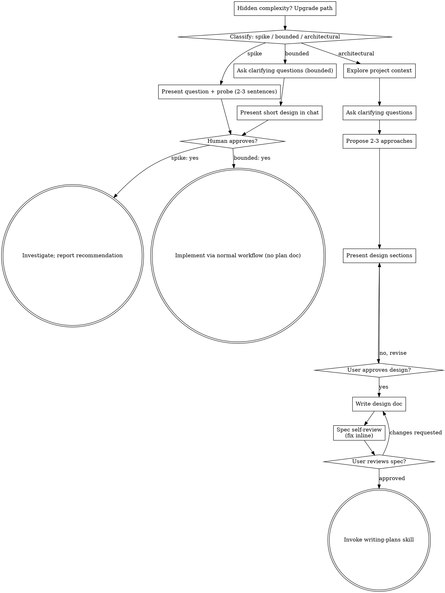

# 把想法转化为设计

通过自然的协作对话，把想法转化为完整设计和规格。

先判断请求需要多少流程，再按相应路径推进：理解上下文、完善想法、展示设计，并取得人类协作者批准。

## 建立共同理解

头脑风暴的结果应是一份人类协作者能够识别和纠正的共同理解，并以他们想实现的目标为基础。

1. **发现意图。**利用请求和已有上下文识别预期结果、目标用户以及成功标准。缺少这些信息时，在提出功能或方法前，先问一个关于目的或预期用途的聚焦问题。知道应用类别并不能说明协作者为什么想做它。收集缺失要求也不等于再次请求任务授权。
2. **复述理解。**用一段简短说明总结预期结果、相关约束和成功标准，让协作者能够判断。区分对方明确说过的内容和你的假设。邀请纠正并吸收回答，之后才能把它当作设计简报。
3. **把意图带入设计。**在所选路径的设计产物中保留达成一致的理解：架构工作写入规格；有界工作和探针写入对话内设计或探查方案。用这份理解检查建议的功能和技术选择。

如果请求已经提供目的和约束，应复述理解，而不是重复询问。说明保持简洁；准确性以及让对方纠正的机会才是重点。

<HARD-GATE>
采取任何实现行动前——包括调用实现技能、编写产品代码、搭脚手架、安装产品依赖或创建外部项目——必须完成所选路径的前置条件：

- 探针：人类协作者批准问题和探查方案。
- 有界：人类协作者批准对话中的简短设计。
- 架构：人类协作者审阅并批准书面规格，再审阅书面实施计划并选择执行方式。对话中的设计批准只允许编写规格；书面规格批准只允许调用 writing-plans。

回复只批准实际展示的阶段。批准想法或功能范围，不代表批准尚不存在的产物。从最早未完成阶段恢复；不要把一次批准扩展成跳过后续环节的许可。前置条件未完成时，允许进行只读项目探索。
</HARD-GATE>

## 三条路径

提出第一个问题前，先分类并明确说出——例如“这看起来是有界变更，所以我会在对话中展示简短设计，而不写规格”——让人类协作者有机会调整：

- **探针（Spike）**——可行性问题（“能不能……”“是否可能……”“快速粗糙也行”），产出是答案，不是要保留的代码。用 2–3 句话展示问题和探查方式，获得同意后，以正确性允许的最低成本查明答案。不写设计文档和规格。以建议形式报告发现，任何构建产物都标为可丢弃。
- **有界（Bounded）**——对仓库中现有代码的范围清晰的变更：新选项、小 endpoint、单文件修复。仅知道应用类别还不够——“有界”意味着要改的流程已经存在且可阅读。没有现有流程可改，就不是有界任务。提出必要的澄清问题，在**对话中**展示简短设计（几句话到几个短段落），然后停止。只有人类协作者明确同意该设计后才能实现——有界任务的批准与架构任务同样是硬门。不写规格文件和实施计划。
- **架构（Architectural）**——新项目、新子系统、重组组件关系或改变他人依赖接口的变更。遵循完整流程：提问、比较方法、分节设计、书面规格，最后使用 writing-plans 技能。

在两条路径之间犹豫时，选择更重的路径。棘轮只能单向移动：任务中发现隐藏复杂性时升级路径——停止、说明情况并进入更高等级。任务进行中不能降级。

## 反模式：“太简单，不需要批准”

每条路径都要求人类协作者在实现前批准相应设计。有界变更可能只需对话中的两句话；新的 todo-list 项目属于架构工作，需要书面规格和计划交接。让产物规模适配所选路径，并在实现前完成该路径的评审。

## 危险信号

| 想法 | 事实 |
|---------|---------|
| “太简单，不需要设计” | 遵循所选路径：有界变更需要简短对话设计；架构变更需要书面规格和计划交接。 |
| “把它叫作有界，就能跳过规格” | 想用标签跳过工作，本身就说明存在疑问——选择更重的路径。 |
| “范围有界且设计明显，我可以边等回复边开始” | 门槛是批准，不是设计长度。展示设计，然后停下来等待肯定答复。 |
| “我熟悉这种应用，所以是有界任务” | 有界衡量的是仓库，不是你的熟悉程度。新项目没有现有流程——属于架构工作。 |
| “探针成功了，所以保留代码” | 探针产出是答案。保留代码属于新请求——重新分类。 |
| “事情变复杂了，但快做完了，不必重新分类” | 隐藏复杂性会在任务中升级路径。停止并说明。 |
| “他们批准了探针，所以后续变更也已获批” | 每项任务都要单独分类和批准。 |

## 检查清单

先分类并说明路径，然后为路径中的每一项创建任务，依序完成。

**探针：**

1. **探索项目上下文**——足以界定探查问题
2. **展示问题和探查计划**——2–3 句话
3. **取得批准**——点头同意即可
4. **调查**——以正确性允许的最低成本进行
5. **报告发现**——给出建议；所有构建内容标为可丢弃

**有界：**

1. **探索项目上下文**——检查文件、文档、近期提交
2. **提出澄清问题**——一次一个，只问真正重要的问题
3. **在对话中展示简短设计**——方法、涉及文件、测试方式
4. **取得批准**——停止并等待明确肯定；一边展示设计一边开始实现，就是跳过门禁
5. **实现**——进入正常开发流程（应用 TDD）；不写计划文档

**架构：**

1. **探索项目上下文**——检查文件、文档、近期提交
2. **在恰当时机提供可视化助手**——不要一开始就提供。第一次出现“看图比文字更清楚”的真实问题时再单独提出；对方同意后，为其打开浏览器标签。如果始终没有视觉问题，就永远不提供。见下方“可视化助手”。
3. **提出澄清问题**——一次一个，理解目的、约束、成功标准
4. **提出 2–3 种方法**——包含权衡和推荐方案
5. **展示设计**——按复杂度分节，并在每节后取得用户批准
6. **编写设计文档**——保存到 `docs/superpowers/specs/YYYY-MM-DD-<topic>-design.md` 并提交
7. **规格自我评审**——快速检查占位符、矛盾、歧义和范围（见下方）
8. **用户审阅书面规格**——继续前请用户评审规格文件
9. **转入实现**——调用 writing-plans 技能创建实施计划

## 流程图

**终止状态由路径决定。**架构路径：头脑风暴后唯一可以调用的技能是 writing-plans——绝不调用 frontend-design、mcp-builder 或其他实现技能。有界路径：批准后直接进入正常开发流程，不写计划文档。探针路径：终止状态是一份建议报告。

## 过程

以下小节服务于有界和架构路径（探针在“展示探查方案并取得同意”后直接调查）。从**探索方法**开始的内容属于架构路径深度；有界工作只需上下文、少量问题和简短对话设计。

**理解想法：**

- 先检查当前项目状态（文件、文档、近期提交）
- 提出详细问题前评估范围：如果请求描述多个独立子系统（例如“构建包含聊天、文件存储、计费和分析的平台”），立即指出。不要花时间细化一个本应先拆分的项目。
- 如果项目大到无法放入一份规格，帮助用户拆成子项目：独立部分是什么、如何关联、按什么顺序构建。然后按正常设计流程对第一个子项目做头脑风暴。每个子项目都有独立的规格 → 计划 → 实现循环。
- 对范围合适的项目，一次问一个问题来完善想法
- 尽量使用选择题，开放问题也可以
- 每条消息只问一个问题；需要深入时拆成多个问题
- 专注理解目的、约束和成功标准

**探索方法：**

- 提出 2–3 种不同方法及其权衡
- 用对话方式展示选项，并说明推荐方案和理由
- 先给出推荐方案，再解释原因
- 严格执行 YAGNI——从每种方案和设计中移除不必要功能

**展示设计：**

- 确信理解要构建的内容后，再展示设计
- 每节长度与复杂度匹配：简单内容几句话，复杂内容最多 200–300 字
- 每节后询问当前设计是否正确
- 覆盖架构、组件、数据流、错误处理和测试
- 如果内容不清楚，随时回退并澄清

**为隔离和清晰而设计：**

- 把系统拆成较小单元，每个单元只有一个明确目的，通过定义良好的接口通信，并能独立理解和测试
- 对每个单元，都应能回答：它做什么、如何使用、依赖什么？
- 不读内部实现能否理解单元行为？修改内部实现会不会破坏调用方？如果不能，说明边界需要改进。
- 小而边界清晰的单元也更容易处理——你对能够一次放入上下文的代码推理得更好，聚焦文件的编辑也更可靠。文件变大通常说明承担了过多职责。

**在现有代码库中工作：**

- 提案前探索现有结构，遵循既有模式
- 如果现有代码中的问题影响当前工作（例如文件过大、边界不清、职责纠缠），把有针对性的改进纳入设计——优秀开发者会改进自己正在处理的代码
- 不要提出无关重构，保持聚焦于当前目标

## 设计之后（架构路径）

**文档：**

- 把已确认设计写入 `docs/superpowers/specs/YYYY-MM-DD-<topic>-design.md`
  - 用户对规格位置的偏好优先
- 如果有 `elements-of-style:writing-clearly-and-concisely` 技能，使用它
- 把设计文档提交到 Git

**规格自我评审：**

写完规格后，以全新视角检查：

1. **占位符扫描：**是否存在 “TBD”“TODO”、未完成章节或模糊要求？修复。
2. **内部一致性：**章节之间是否矛盾？架构与功能描述是否一致？
3. **范围检查：**是否足够聚焦，可由一份实施计划完成？还是需要拆分？
4. **歧义检查：**是否有要求能被理解成两种意思？选择一种并明确写出。

发现问题就直接修复，无需重新评审。

**用户评审门：**

规格评审通过后，请用户在继续前审阅书面规格：

> “Spec written and committed to `<path>`. Please review it and let me know if you want to make any changes before we start writing out the implementation plan.”

等待用户回复。若其要求修改，应用修改并重新运行规格评审。只有批准后才能继续。

**实现：**

- 调用 writing-plans 技能创建详细实施计划
- 不要调用其他技能。下一步只能是 writing-plans。

## 可视化助手

可视化助手是一种基于浏览器的工具，用于在头脑风暴期间展示模型、图表和视觉选项。它是工具，不是模式。接受助手只表示它可用于适合视觉呈现的问题，不表示每个问题都必须在浏览器中处理。

**在恰当时机提供：**不要一开始就提出。等到某个问题确实“看图比读文字更清楚”时——真实的模型、布局或图表问题，而不只是 UI 主题——再首次提出，并且该消息只能包含以下邀请：

> “This next part might be easier if I show you — I can put together mockups, diagrams, and comparisons in a browser tab as we go. It's still new and can be token-intensive. Want me to? I'll open it for you.”

**邀请必须单独成一条消息。**不能附带澄清问题、摘要或其他内容。等待用户回答。同意后，用 `--open` 启动服务器，让浏览器自动打开首个画面。拒绝后继续使用文字；除非用户再次提出，否则不要重复邀请。

**逐问题决策：**即使用户同意，也要对每个问题单独判断使用浏览器还是终端。判断标准：**用户看到内容是否比阅读文字更容易理解？**

- **使用浏览器**处理真正的视觉内容——模型、线框、布局比较、架构图和并排视觉设计
- **使用终端**处理文字内容——需求问题、概念选择、权衡列表、A/B/C/D 文字选项和范围决策

UI 主题的问题不一定是视觉问题。“这里的个性是什么意思？”属于概念问题，使用终端。“哪种向导布局更合适？”属于视觉问题，使用浏览器。

如果用户同意使用助手，继续前阅读详细指南：`skills/brainstorming/visual-companion.md`
