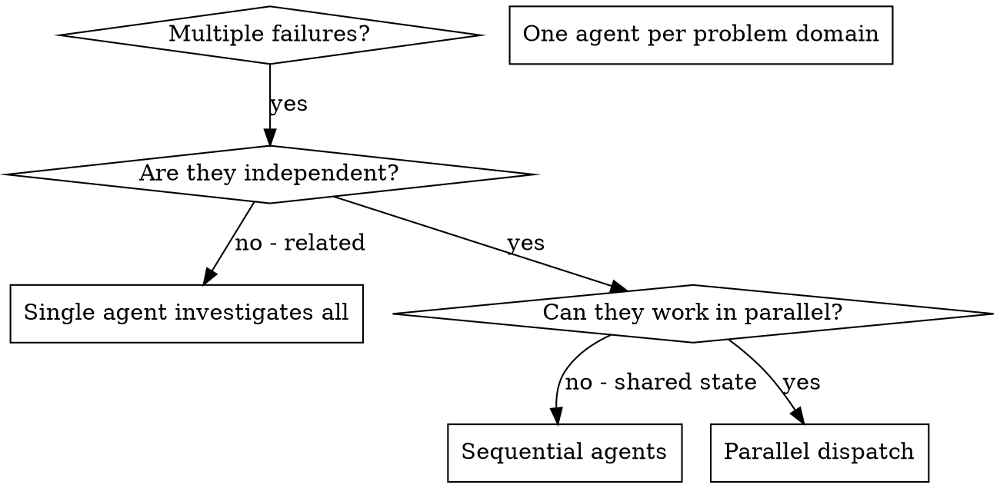

# 派遣并行 Agent

## 概述

把任务委派给具有隔离上下文的专用 Agent。通过精确组织指令和上下文，让它们专注并顺利完成任务。它们绝不应继承你的会话上下文或历史——由你准确构造它们需要的内容。这样也能保留你自己的上下文用于协调工作。

当多个不相关的问题同时失败（不同测试文件、不同子系统、不同 bug）时，依次调查会浪费时间。每项调查彼此独立，可以并行进行。

**核心原则：**每个独立问题域派遣一个 Agent，让它们并发工作。

## 使用时机



**以下情况使用：**

- 3 个以上测试文件因不同根因失败
- 多个子系统彼此独立地损坏
- 每个问题都能在不了解其他问题上下文的情况下理解
- 各项调查之间没有共享状态

**以下情况不要使用：**

- 失败彼此相关（修复一个可能修复其他问题）
- 需要理解完整系统状态
- Agent 会互相干扰

## 模式

### 1. 识别独立问题域

按损坏内容对失败分组：

- 文件 A 测试：工具审批流程
- 文件 B 测试：批次完成行为
- 文件 C 测试：中止功能

每个问题域都是独立的——修复工具审批不会影响中止测试。

### 2. 创建聚焦的 Agent 任务

每个 Agent 获得：

- **明确范围：**一个测试文件或子系统
- **清晰目标：**让这些测试通过
- **约束：**不要修改其他代码
- **预期输出：**对发现和修复内容的摘要

### 3. 并行派遣

在同一条响应中发出三个子 Agent 派遣，让它们并行运行：

```text
子 Agent（general-purpose）："修复 agent-tool-abort.test.ts 的失败"
子 Agent（general-purpose）："修复 batch-completion-behavior.test.ts 的失败"
子 Agent（general-purpose）："修复 tool-approval-race-conditions.test.ts 的失败"
# 三者并发运行。
```

同一条响应中多次调用派遣 = 并行执行。每条响应只调用一次 = 顺序执行。

### 4. 评审并集成

Agent 返回后：

- 阅读每份摘要
- 验证修复之间没有冲突
- 运行完整测试套件
- 集成所有变更

## Agent 提示结构

优秀的 Agent 提示应当：

1. **聚焦**——只有一个清晰的问题域
2. **自包含**——包含理解问题所需的全部上下文
3. **明确输出**——说明 Agent 应返回什么

```markdown
修复 src/agents/agent-tool-abort.test.ts 中 3 个失败的测试：

1. "should abort tool with partial output capture"——期望消息中包含 'interrupted at'
2. "should handle mixed completed and aborted tools"——快速工具被中止，而不是完成
3. "should properly track pendingToolCount"——期望 3 个结果，实际为 0

这些是时序或竞争条件问题。你的任务：

1. 阅读测试文件，理解每项测试验证什么
2. 找到根因——是时序问题还是真正的 bug？
3. 通过以下方法修复：
   - 用基于事件的等待替代任意超时
   - 如果发现中止实现中的 bug，修复它
   - 如果测试的是已经变化的行为，调整测试预期

不要只是增加超时时间——找出真正的问题。

返回：所发现问题和修复内容的摘要。
```

## 常见错误

**❌ 范围太宽：**“修复所有测试”——Agent 会迷失
**✅ 具体：**“修复 agent-tool-abort.test.ts”——范围聚焦

**❌ 没有上下文：**“修复竞争条件”——Agent 不知道问题在哪
**✅ 有上下文：**粘贴错误消息和测试名称

**❌ 没有约束：**Agent 可能重构一切
**✅ 有约束：**“不要修改生产代码”或“只修测试”

**❌ 输出模糊：**“修好它”——你不知道改了什么
**✅ 输出具体：**“返回根因和变更摘要”

## 不应使用的情况

**相关失败：**修复一个可能修复其他问题——先一起调查。
**需要完整上下文：**必须看到整个系统才能理解。
**探索性调试：**还不知道哪里出了问题。
**共享状态：**Agent 会互相干扰（编辑相同文件、使用相同资源）。

## 会话中的真实示例

**场景：**一次大型重构后，3 个文件中出现 6 个测试失败。

**失败：**

- agent-tool-abort.test.ts：3 个失败（时序问题）
- batch-completion-behavior.test.ts：2 个失败（工具未执行）
- tool-approval-race-conditions.test.ts：1 个失败（执行次数为 0）

**决策：**这些是独立问题域——中止逻辑与批次完成、竞争条件彼此分离。

**派遣：**

```
Agent 1 → 修复 agent-tool-abort.test.ts
Agent 2 → 修复 batch-completion-behavior.test.ts
Agent 3 → 修复 tool-approval-race-conditions.test.ts
```

**结果：**

- Agent 1：用基于事件的等待替代超时
- Agent 2：修复事件结构 bug（threadId 位于错误位置）
- Agent 3：增加等待，直到异步工具执行完成

**集成：**所有修复彼此独立、无冲突，完整套件通过。

## 验证

Agent 返回后：

1. **阅读每份摘要**——理解修改内容
2. **检查冲突**——Agent 是否编辑了相同代码？
3. **运行完整套件**——验证所有修复能共同工作
4. **抽查**——Agent 可能产生系统性错误
