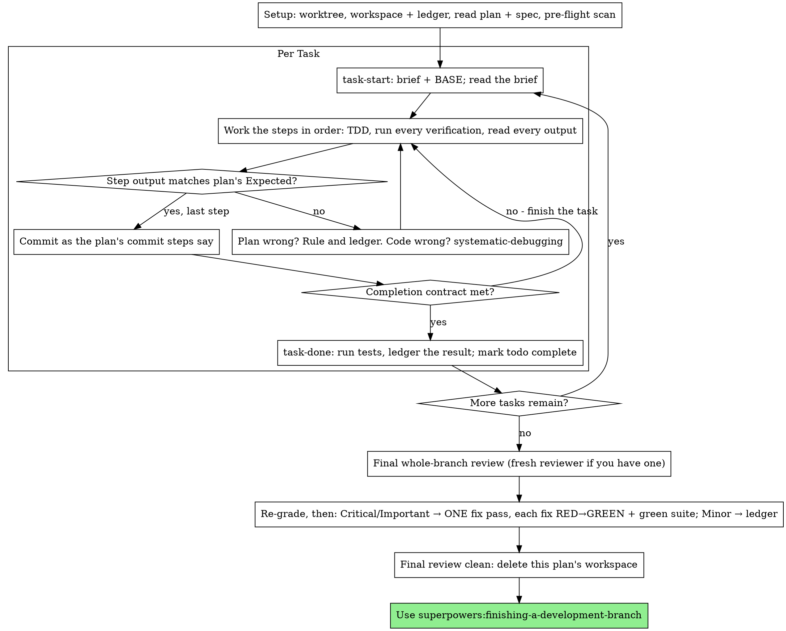

# 执行计划

在当前会话中由你亲自逐项执行计划：每项任务不派实施子 Agent，也不逐项派评审者；在最后对整个分支做一次全新上下文评审。

**为何内联执行：**子 Agent 驱动开发会为每项任务使用新的实施者和评审者，两者都要从头阅读代码库。内联执行只使用一个上下文（你的）和最后一个评审者。它放弃了每项任务的新上下文和第二双眼睛。本技能用其他方式保留两者的价值：简报就是规格，台账就是记忆，TDD 是逐任务门禁，最终评审者是第二双眼睛。

**核心原则：**计划已经完成思考。准确执行，用亲眼看到先失败再通过的测试证明每一步，并留下即使自己忘记也能恢复的记录。

**叙述：**工具调用之间最多说明一行；记录由台账和工具结果承载。

**连续执行：**任务之间不要停下来询问人类协作者是否继续。对方选择内联执行是为了节省成本，而不是每项任务都回答“要继续吗？”。不停顿地执行计划中的全部任务。

**作出裁定，不要停滞。**冲突、歧义和计划缺陷都由你决定。规格是约束性依据，计划是从规格得出的论证；两者未回答的内容由你的判断解决。把每项决定按 `Ruling: <决定> — <理由> — <如果错了的代价>` 写入台账，然后继续。偏离计划却不记录裁定，就是作出未向协作者公开的决定。

只有四件事能让你停止：不可逆或破坏性操作；安全敏感操作；按惯例应先询问、且影响此 worktree 之外的副作用（合并、推送共享分支、发布）；计划已经坏到所有前进路径都只能猜。遇到这些情况才停止询问。

## 使用时机

- 已有 `superpowers:writing-plans` 产出的计划，且人类协作者在交接时选择内联执行。
- 当前运行环境没有子 Agent 工具（见 `../using-superpowers/references/` 中的平台参考）。不要声称已派遣实际并未派遣的任务；应在本会话执行计划。
- 大多数任务彼此独立——与 `superpowers:subagent-driven-development` 的前置条件相同。

一份完整明确的计划会把内联执行变成照章实现和测试：中等能力会话模型也能良好完成，最强模型成本最值得花在最后的整体评审，由本技能单独派遣。协作者选择内联时要说明这一点。

如果协作者希望每项任务都经过评审门，或计划长到后面的任务会在压缩上下文中执行，应优先选择 `superpowers:subagent-driven-development`。长计划仍可内联执行——台账使其可以恢复——但越靠后的任务越缺少完整上下文。

## 流程



## 设置

确保工作在隔离工作区中进行：使用 `superpowers:using-git-worktrees` 创建或核验现有 worktree。未经人类协作者明确同意，绝不要在 main/master 分支上开始实现。

对话记忆无法跨上下文压缩保存。丢失位置的内联执行者会重新实现已经存在提交的任务——这与控制器重复派遣相同，只是消耗自己的上下文。用台账文件跟踪进度，不能只依赖 todo。运行环境 todo 是实时视图，台账才是记录。

工作区和台账与 `superpowers:subagent-driven-development` 共享——目录和格式相同——因此计划可以中途更换执行方式，新执行者能从相同台账恢复。

- 每份计划拥有一个工作区：技能开始时运行 `../subagent-driven-development/scripts/sdd-workspace PLAN_FILE`。它会输出计划专属的 Git 忽略目录（`<repo-root>/.superpowers/sdd/<plan-basename>/`），保存**该计划**的台账、简报和评审材料包。绝不要读写其他计划的目录。
- 检查 `<workspace>/progress.md`。如果第一行指向当前计划，含有 `Task <N>: complete` 的任务已经完成，不要重做；从第一个没有完成记录的任务恢复。即使上下文压缩后不记得提交，Git 历史中仍然存在：相信台账和 `git log`。如果第一行指向其他计划，就保持原状，为当前计划创建全新台账。
- 台账首行写：`# SDD ledger — plan: <plan file path>`。
- `git clean -fdx` 会销毁被忽略的工作区；若发生，从 `git log` 恢复。

完整阅读计划一次，记录上下文和全局约束，并为每项任务创建 todo。若计划引用规格，也要阅读；规格是计划的权威来源，计划内部冲突按规格解决。无法找到规格时，在台账记录这一点——没有规格依据的裁定属于临时决定。

**必需子技能：**在任务 1 前加载 `superpowers:test-driven-development`。它约束后续每项任务；计划本身写了“先写失败测试”也不能代替阅读该技能。

任务 1 前扫描计划中的跨任务冲突。查看每项任务的 Interfaces：早期任务产物被后续任务消费时，写一行台账，记录双方、产物和消费接口以及检查结果。完全不共享接口的任务不写；所有任务均无共享接口时只写 `Pre-flight: no shared interfaces`。发现冲突时，以规格为依据作出裁定并记录，再开始任务 1。每项任务自身内容在读取其简报时检查。

## 任务循环

你打印的内容和每个工具结果都会在本会话后续上下文中保留。把长测试输出重定向到工作区文件，只读取尾部；读取简报，而不是反复读取完整计划。

### 1. 接受任务

- 运行本技能的 `scripts/task-start PLAN_FILE N`。一次输出简报路径和 BASE（任务差异范围的起始提交）。每项任务都要阅读简报，即使你记得设置；记忆只是摘要，简报包含准确值、签名和测试用例。
- 把任务 todo 标为 in_progress。

每次工具调用都会重新读取完整上下文。记账应与工作同行——台账追加与提交处于同一消息，绝不留到后续调用。

### 2. 执行步骤

计划步骤已经按 RED→GREEN 排列；在开始时加载的 `superpowers:test-driven-development` 约束下依序执行。测试步骤必须先编写、先运行。看到它失败不是形式，而是步骤；实现不存在时测试却通过，说明测试本身有问题。

计划中每条命令都有 `Expected:`。运行命令、阅读输出并比较，结果有三类：

- **匹配。**进入下一步。
- **代码错误。**使用 `superpowers:systematic-debugging` 找根因；绝不修补症状来迎合预期输出。
- **计划错误。**步骤与规格冲突、早期任务接口与消费者不匹配，或命令无法工作。作出满足规格的最小变更，在台账写 `Task <N>: Ruling: <发现> — <决定和理由>`，然后继续。裁定必须被记录，而不是只靠记忆；后续接触同一接口的任务会从台账读取。

按计划提交步骤操作。一项任务跨多个提交也可以；评审范围的 BASE 始终是任务开始时的提交，绝不是 `HEAD~1`。

### 3. 完成契约

写入任务完成台账前，以下条件都必须有本次会话中的证据，不能仅凭 diff 看起来正确：

- 简报点名的每个测试都已存在，并在本任务中实际运行，且你阅读了输出。
- 本任务最终测试运行通过；该运行由 `task-done` 完成并把命令和结果写入台账。
- 每条 `Expected:` 都已与真实输出比较。
- 每次偏离简报都已有 `Ruling:` 台账记录。

**必需子技能：**完成声明受 `superpowers:verification-before-completion` 约束。缺少任何一项，任务就没有完成；先补齐。

### 4. 完成任务

使用简报为整个任务指定的测试命令运行：

`scripts/task-done PLAN_FILE N BASE -- <test command>`

它会运行测试，把完整输出保存到工作区，只打印尾部，并且只在测试通过时追加：

`Task <N>: complete (commits <base7>..<head7>, tests: <command> → <result>)`

失败运行不会记录任何内容，任务仍未完成。记录成功后，把 todo 标为 complete，接受下一任务。

## 最终评审

运行 `../subagent-driven-development/scripts/review-package PLAN_FILE MERGE_BASE HEAD`（MERGE_BASE 是分支起点，例如 `git merge-base main HEAD`），从它输出的文件开始评审。

**有子 Agent 工具时：**在能力最强的可用模型上派遣评审者——整分支评审是判断任务。使用 `superpowers:requesting-code-review` 的 [code-reviewer.md](../requesting-code-review/code-reviewer.md)，提供材料包路径、计划和规格路径、计划 Review Focus 原文（任务测试未覆盖的输入类别和失败模式，评审者逐项检查），以及台账 `Ruling:` 行的位置。明确指定模型；省略会继承会话模型，可能不是最强模型。这是整次运行购买的唯一新上下文。不得跳过，也不得用自己阅读 diff 代替。

**没有子 Agent 工具时：**阅读 code-reviewer.md，在最后任务台账行之后，以独立一轮自行评审材料包。在台账写 `Final review: self-review (no subagent tool)`，并在最终消息说明：作者自审弱于全新评审者，由人类协作者决定合并前是否足够。

在处理任何发现前先排序。评审者的严重级别只是建议；门禁由你掌握。其 “Declined to judge” 列表也归你处理：每一项都像计划冲突一样裁定并写台账：`Final: Ruling: <被搁置行为> — <合理用户会得到什么、为何维持或为何成为发现> — <错误代价>`。先按用户影响重新分级：规格是愿景文档，严重度取决于合理用户实际会遭遇什么，而不是规格是否点名触发输入。因规格沉默就定为 Minor，是在给规格打分，不是在评估影响。

- **Critical 和 Important**进入一次修复轮。
- **Minor**写入台账：`Final: minor (deferred): <一句话>`，并在最终消息的“Deferred minors”中列出。Minor 不进入修复轮，也不变成裁定——裁定解决冲突，不是拒绝润色建议的记录。

你是实施者，因此 Critical 和 Important 由你在**一轮**中修复。每项修复由 TDD 验证，而不是再次派评审：写出能复现发现的测试，看着它失败，使其通过，再运行完整套件。台账写：`Final: fixed <发现> — <测试名> RED→GREEN, suite <N>/<N>`。没有先失败的测试，就没有验证；修复后套件不绿，说明本轮未结束。不要再派复审：覆盖测试已回答“是否修复”，绿色套件已回答“是否破坏其他内容”。

决定不修的发现必须成为裁定：`Final: Ruling: <发现> — <为何维持代码> — <错误代价>`，并在最终消息中告知人类协作者。没有第二轮修复。

## 收尾

删除任何内容前，把台账中所有 `Ruling:` 行按出现顺序收集到最终消息的“Rulings I made”，每项带错误代价；把所有 `minor (deferred)` 行收集到“Deferred minors”。两份列表必须完整。最终消息是你代协作者作出的决定和未处理发现唯一能到达他们的地方。

最终评审干净、修复已经提交后，删除**本计划**的工作区目录——此时 Git 历史就是记录。兄弟目录属于其他计划，不要动。

使用 `superpowers:finishing-a-development-branch`。

## 常见借口

| 借口 | 事实 |
|---------|---------|
| “我记得任务 N” | 你记得的是摘要。简报才有准确值。阅读它。 |
| “计划代码正确，跳过观察失败测试” | 没看到失败的测试什么也证明不了。它本身就是一步。 |
| “最后再跑完整套件” | 逐步运行才能知道哪一步破坏了行为。任务末门禁不能替代逐步验证。 |
| “计划错了，我直接做正确的事” | 做正确的事，并把裁定写入台账。未记录的偏离不会向协作者公开。 |
| “几项任务后再补台账” | 上下文压缩不会等待方便时机。每项任务一行，与提交同一消息写入。 |
| “下一项前询问是否继续” | 对方选择内联是为了节省成本，不是不断回答进度问题。只有四类停止条件。 |
| “我认真看过自己的 diff，不必最终评审” | 同一个作者有同样盲点。全新评审者是此次运行唯一的第二双眼睛。 |
| “测试应该能过，变更很小” | “应该”不是证据。契约要求命令及其输出。 |
| “子 Agent 又慢又贵，最终评审也跳过” | 内联已经省掉逐任务评审。一次整体评审是底线。 |
| “评审者说 Minor，所以就是 Minor” | 按用户影响分级，不要按规格沉默分级。 |
| “修复明显，不用先写失败测试” | 失败测试是问题真实存在且现已消失的唯一证明。否则只有 diff 和希望。 |
| “顺便修 Minor” | 每个 Minor 都意味着额外测试、修复和套件运行。写入台账，由协作者决定。 |

## 工作流示例

```
你：I'm using the executing-plans skill to implement this plan inline.

[设置：已核验 worktree]
[完整阅读一次计划：docs/superpowers/plans/feature-plan.md；已阅读规格]
[解析工作区：sdd-workspace docs/superpowers/plans/feature-plan.md——其中没有台账，从头开始]
[预检扫描：2 行共享接口、4 行内部一致性，结果无问题；写入台账]
[为全部任务创建 todo]

任务 1：hook 安装脚本

[task-start plan 1 → 已阅读简报；BASE a1b2c3d]
[步骤 1：编写失败测试——已写入]
[步骤 2：运行测试——失败：install_hook 未定义。符合 Expected。]
[步骤 3：实现——已写入]
[步骤 4：运行测试——通过 1/1。符合 Expected。]
[步骤 5：提交——d4e5f6a]
[契约：已运行测试、已阅读输出、没有偏离]
[task-done plan 1 a1b2c3d -- npm test -- hooks → 台账：Task 1: complete (commits a1b2c3d..d4e5f6a, tests: npm test -- hooks → 1/1 pass)]

任务 2：恢复模式

[task-start plan 2 → 已阅读简报；BASE d4e5f6a]
[步骤 2：运行失败测试——失败，但原因是导入错误：任务 1 导出
 installHook，简报却使用 install_hook]
[裁定：简报中的消费方名称与任务 1 的 Produces 块冲突，属于拼写错误；
 使用 installHook——台账：Task 2: Ruling: install_hook → installHook — 与任务 1 的 Produces 一致 — 如果错误，代价是重命名一次]
[按计划执行步骤 2–5；提交 b7c8d9e]
[task-done plan 2 d4e5f6a -- npm test -- recovery → 台账：Task 2: complete (commits d4e5f6a..b7c8d9e, tests: npm test -- recovery → 8/8 pass)]

...

[所有任务后：review-package plan MERGE_BASE HEAD；派能力最强的 code-reviewer]
评审者：1 项 Important——进度报告间隔为硬编码；另有 2 项 Minor。
[重新分级：Important 维持；Minor → 作为 deferred 写入台账]
[修复轮：test_progress_interval_configurable RED → 提取 PROGRESS_INTERVAL → GREEN；全套 12/12；提交]
[台账：Final: fixed hardcoded interval — test_progress_interval_configurable RED→GREEN, suite 12/12]

Rulings I made:
- Task 2: install_hook → installHook（简报拼写错误；如果错误，代价是重命名一次）

Deferred minors:
- README 缺少使用示例
- recovery.js 可以把 verify/repair 拆成两个文件

[删除本计划工作区——记录现已保存在 Git 历史中]

使用 superpowers:finishing-a-development-branch。
```
