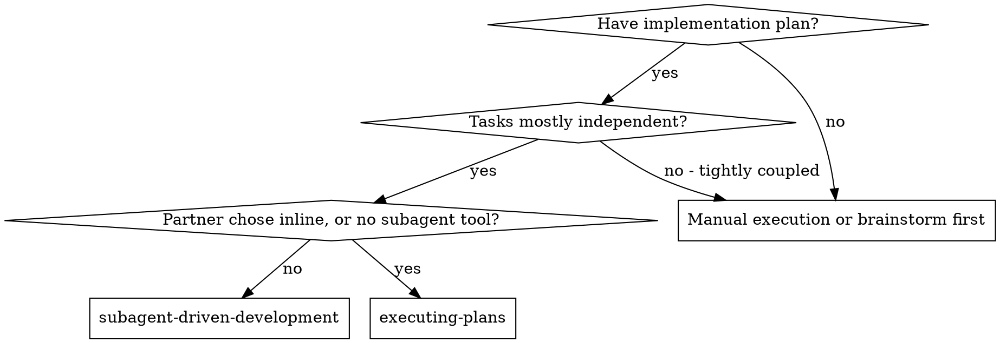
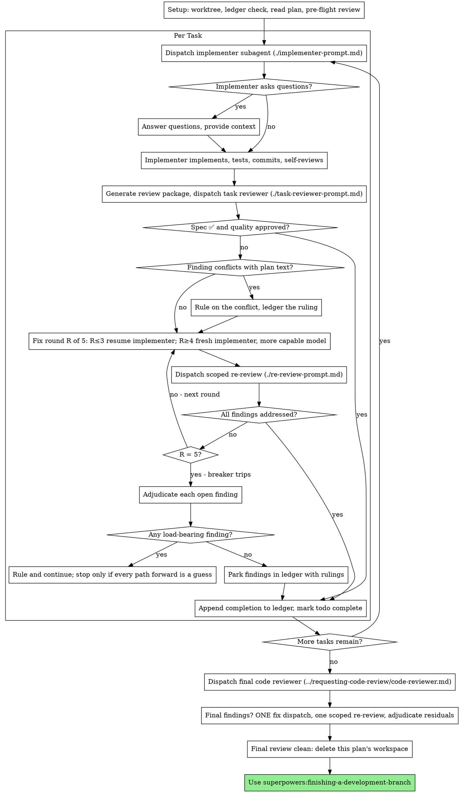

# 子 Agent 驱动开发

通过以下方式执行计划：每项任务派遣一个全新的实施子 Agent；每项任务完成后评审规格符合性和代码质量；最后再对整个分支做广泛评审。

**为何使用子 Agent：**把任务委派给上下文隔离的专用 Agent。精确构造指令和上下文，使它们保持专注并完成任务。它们绝不应继承你的会话上下文或历史——由你提供它们实际需要的内容。这样也能保留你自己的上下文用于协调。

**核心原则：**每项任务使用全新子 Agent + 任务评审（规格与质量）+ 广泛最终评审 = 高质量、快速迭代。

**叙述：**工具调用之间最多说明一行；台账和工具结果承载记录。

**连续执行：**任务之间不要停下来询问人类协作者。除下文列出的四类停止条件或全部任务完成外，持续执行完整计划。“要继续吗？”和进度摘要只会浪费对方时间——对方要求的是执行计划。

**作出裁定，不要停滞。**运行中的计划不等待人类回答。冲突、歧义、计划缺陷，以及原本会询问是否超出的限制，都由你决定。规格是权威依据，计划是其论证，两者未回答的内容由你判断。把每项决定按 `Ruling: <决定> — <理由> — <错误代价>` 写入台账，然后继续。错误裁定只会造成协作者看得见、可撤销的返工；让会话停在问题上会浪费对方整天时间，却没有产出。

只有四件事能让你停止：不可逆或破坏性操作；安全敏感操作；按惯例应先询问、且影响此 worktree 之外的副作用（合并、推送共享分支、发布）；计划已经坏到所有前进路径都只能猜。遇到这些情况才停止询问。

## 使用时机



**与 Executing Plans（内联）相比：**

- 每项任务使用全新子 Agent（没有上下文污染），而不是由一个上下文执行全部任务
- 每项任务后评审规格符合性和代码质量，而不是只在最后评审
- 每项任务和评审都要消耗全新上下文；内联只需一个上下文加一个最终评审者
- 两者都在当前会话运行，共享计划工作区和台账，并且任务间不停顿

## 流程



## 设置

使用 `superpowers:using-git-worktrees` 创建或核验隔离工作区。未经人类协作者明确同意，不得在 main/master 上实现。

对话记忆不能跨上下文压缩保存。真实会话中，丢失位置的控制器曾重新派遣整串已完成任务——这是成本最高的已观察故障。用台账文件跟踪进度，不能只依赖 todo。

- 每份计划有独立工作区。技能开始时运行 `bash scripts/sdd-workspace PLAN_FILE`，它会输出 `<repo-root>/.superpowers/sdd/` 下被 Git 忽略的计划目录，保存**本计划**的台账、简报、报告和评审材料包。绝不读写其他计划目录。
- 检查 `<workspace>/progress.md`。首行指向当前计划时，带有 `Task <N>: complete` 的任务已经完成，不得重新派遣；从第一个未完成任务恢复。最后一行是 fix round 的任务仍在循环中，应从下一轮恢复。首行指向其他计划，或旧平铺路径 `.superpowers/sdd/progress.md` 中的台账，都属于其他计划；保持不动，创建自己的新台账。
- 首行写 `# SDD ledger — plan: <plan file path>`。
- 台账是恢复地图：即使上下文不记得，记录的提交仍在 Git 中。压缩后相信台账和 `git log`。
- `git clean -fdx` 会销毁被忽略的工作区；发生后从 `git log` 恢复。

完整阅读计划一次，记录上下文与全局约束，并为每项任务创建 todo。计划引用规格时也要阅读；规格是权威依据，计划冲突按规格解决。找不到规格时写入台账，没有规格支撑的裁定属于临时决定。

派遣任务 1 前，对计划做一次冲突扫描，并边检查边记录：

- 任务之间或任务与全局约束之间的矛盾
- 计划明确要求、但评审规则视为缺陷的内容（例如没有断言的测试、逐字重复逻辑块）

扫描输出是表格，不是一句结论。共享文件或接口的每对任务都要有一行，记录产出、消费关系和检查结果；每项任务都要有一行说明其内部是否自洽——测试与代码是否匹配、创建的文件与后续修改的文件是否一致。只写“扫描干净”不算执行扫描。

把表格写入台账。执行前对全部发现作出裁定——逐项对照要求该行为的计划文本——并记录。扫描干净则直接继续。以规格为权威处理冲突，并派遣任务 1。评审循环会捕获只有实现后才显现的问题。

## 模型选择

为节省成本并提高速度，每种角色使用能够胜任的最低能力模型。

**机械实现任务**（隔离函数、明确规格、1–2 个文件）：使用快速便宜模型。计划明确时，多数实现任务都是机械工作。

**集成和判断任务**（多文件协调、模式匹配、调试）：使用标准模型。

**架构和设计任务：**使用能力最强的可用模型。最终整分支评审属于此类；明确派到最强模型，而不是会话默认模型。

**评审任务：**选择具有相同判断能力、并与 diff 大小、复杂度和风险相称的模型。小型机械 diff 不需要最强模型；细微并发变更需要。小型修复 diff 的定向复审使用便宜到中档模型。

**修复循环升级（第 4–5 轮）：**使用至少比卡住的实施者高一档的模型。

**派遣子 Agent 时始终明确指定模型。**省略会继承会话模型，通常是最强、最贵的模型，悄然违背本节。

**轮次数比 token 单价重要。**实际耗时和上下文成本随子 Agent 轮次增加；最便宜模型处理多步任务时常需要 2–3 倍轮次，总成本反而更高。评审者和根据文字说明实现的 Agent 至少使用中档模型。若计划已经给出完整代码，实施只是抄写和测试，使用最便宜档；单文件机械修复也用最便宜档。

**实现任务复杂度信号：**

- 1–2 个文件且规格完整 → 便宜模型
- 多文件且有集成问题 → 标准模型
- 需要设计判断或广泛理解代码库 → 最强模型

## 任务循环

**批处理小型同形工作。**如果计划列出多个小而独立、形态相同的任务——同样的一行修复、常量变更或字段添加重复到不同文件——不要逐项派子 Agent。把所有文件和变更写进**一份**简报，交给一个子 Agent，把整个 diff 作为单元评审。只有需要独立判断、测试或评审面的工作才每任务一次派遣。

粘贴进派遣提示的所有内容和子 Agent 返回的所有内容，都会在后续会话中驻留并在每轮重新读取。通过文件交接产物。

**等待子 Agent：**不要用很短超时轮询，也不要无限静默等待。有本地工作时继续更新台账、准备下一评审、阅读报告；子结果会自行到达。确实空闲时，以平台允许的 5–10 分钟有界等待；等待之间发布一行状态，并核对存活子 Agent，追查已结束却未报告的任务。有界等待既保留长等待效率，也确保卡住或丢失的子任务在数分钟内被发现。

### 1. 派遣实施者

派遣前记录 BASE（`git rev-parse HEAD`），供评审材料包和修复轮 diff 使用。

- **任务简报：**派遣前运行 `bash scripts/task-brief PLAN_FILE N`。它把任务完整文本提取到唯一文件并输出路径。派遣中让简报成为唯一要求来源：(1) 一行说明任务在项目中的位置；(2) 简报路径，并说明“先阅读——其中是要求，准确值必须逐字采用”；(3) 简报无法知道的早期任务接口和决定；(4) 你对简报歧义的裁定；(5) 报告文件路径和报告契约。数字、魔法字符串、签名和测试用例只出现在简报中。绝不要让子 Agent 读完整计划。
- **报告文件：**按简报名命名（`task-N-brief.md` → `task-N-report.md`）并放入提示。实施者把完整报告写入其中，只返回状态、提交、一行测试摘要和顾虑。
- 提示描述一项任务，不描述会话历史。不要把累计的前置任务摘要粘贴进后续派遣。真实会话曾产生 42k 字符提示，其中 99% 是复制历史。全新子 Agent 只需要自身任务、接触的接口和全局约束。
- 派遣包含禁止子 Agent 再派子 Agent 的契约（实施者模板已包含）：实施者绝不派助手或评审者。评审由控制器在报告后发起。真实会话中，实施者自行派出的评审全部重复了控制器的任务评审，等于每项任务多付一个完整评审席位。
- 若早期任务在当前区域搁置发现，派遣中带上相应台账条目指针。
- 从派遣结果记录实施者身份；第 1–3 轮修复会恢复这个 Agent。
- 绝不并行派遣多个实施子 Agent，避免冲突。

模板：[implementer-prompt.md](implementer-prompt.md)

### 2. 处理报告

实施者报告四种状态：

**DONE：**运行 `bash scripts/review-package PLAN_FILE BASE HEAD` 生成评审材料包并使用输出路径派任务评审者。BASE 是派遣前记录的提交，绝不能用会漏掉多提交任务前面变更的 `HEAD~1`。

**DONE_WITH_CONCERNS：**工作完成但有疑虑。继续前阅读。正确性或范围疑虑要在评审前处理；观察性意见（如“文件变大”）记录后继续。

**NEEDS_CONTEXT：**补充缺失上下文并重新派遣。

**BLOCKED：**评估阻塞原因：

1. 上下文不足 → 补充上下文，用同一模型重新派遣
2. 需要更多推理 → 换更强模型
3. 任务太大 → 拆成较小部分
4. 计划错误 → 裁定并写台账，携带裁定重新派遣

绝不忽略升级请求，也不要在没有改变条件时强迫同一模型重试。实施者说卡住，就必须改变某些东西。

实施者开始前或中途提问时，清晰完整回答，按需提供额外上下文，不要催促实现。

### 3. 评审任务

逐任务评审是局部门禁，广泛评审只在最终整分支评审进行一次。绝不跳过任务评审，也不接受缺少任一裁定的报告——规格符合性和任务质量都必须有结论。实施者自审不能替代任务评审，两者都需要。

- 用文件交付 diff：运行 `bash scripts/review-package PLAN_FILE BASE HEAD`，把输出路径交给评审者；没有 bash 时，把范围的 `git log --oneline`、`git diff --stat`、`git diff -U10` 重定向进唯一文件。完整输出不进入控制器上下文，评审者一次 Read 就能看到提交、统计和带上下文 diff。使用派遣前记录的 BASE，绝不用 `HEAD~1`。没有 diff 文件就不能派任务评审。
- **评审输入：**相同简报、报告文件、评审材料包三条路径，以及约束该任务的全局要求。
- 全局约束是评审注意力透镜。从计划或规格逐字复制准确值、格式和组件关系。评审模板已包含 YAGNI、测试卫生和评审方法；约束块只承载**本项目**的规格要求。
- 没有具体任务理由时，不要加入“检查全部用法”“有用就跑竞态测试”等开放指令。
- 不要求评审者重复运行实施者已在相同代码上运行的测试；测试证据在报告中。
- 不要预判发现。绝不要求评审者忽略某问题。如果提示中出现 “do not flag”“don't treat X as a defect”“at most Minor” 或 “the plan chose”，说明你在预判，通常是为了逃避评审循环，必须停止。

评审者可能报告 “⚠️ Cannot verify from diff”——要求位于未改代码或跨任务。它们不阻止其余评审，但标记任务完成前必须由你逐项解决，因为你拥有评审者缺失的计划和跨任务上下文。确认是真缺口时，按规格评审失败处理，进入修复循环。

模板：[task-reviewer-prompt.md](task-reviewer-prompt.md)

### 4. 修复循环

规格评审为 ❌、存在 Critical/Important，或你确认 ⚠️ 是真实缺口时进入循环。

进入前有两条直接出口：

- Minor 发现随时写入台账：`Task <N>: minor (deferred): <一句话>`，并让最终评审看到列表、决定哪些合并前必须修。无人阅读的汇总等于静默丢弃。Minor 不进入循环。
- 标为 plan-mandated 或与计划文本冲突的发现由你裁定：对照计划要求，以规格为权威作决定，先写台账再行动。不能因计划要求就驳回发现，也不能在没有裁定时派出违反计划的修复。

其他发现进入循环。每轮包含一次修复派遣和一次定向复审，每项任务最多五轮。

**第 1–3 轮——恢复原实施者。**逐字发送未解决发现。其上下文仍完整。若平台不能向存活子 Agent 发送消息，就派新实施者并提供简报、报告和发现；报告文件在两种情况下都是持久记忆。

**第 4–5 轮——使用更强模型派全新实施者。**提供简报、报告、未解决发现，并说明：“先前实施者已经尝试此任务 [N] 次；现在由你负责。阅读报告了解已尝试内容。”三次恢复仍未解决，通常说明实施者看不到自己的问题，应同时引入新视角和能力升级。

**每一轮：**实施者修复、重新运行覆盖修改代码的测试、把修复报告追加到同一报告文件，只返回简短契约。再次派评审前，确认报告包含覆盖测试、运行命令和输出。修复消息点名覆盖测试文件；一行修复无需完整套件。

**复审必须定向。**以先前评审看到的 head 为 FIX_BASE，运行 `bash scripts/review-package PLAN_FILE FIX_BASE HEAD`，使用 [re-review-prompt.md](re-review-prompt.md) 交付发现列表、简报、报告和 diff。复审逐项裁定 ADDRESSED 或 NOT ADDRESSED，并且只在修复 diff 中发现新破坏。新 Critical/Important 加入未解决列表；范围外观察记为 deferred minor，不延长循环。

每轮后追加：`Task <N>: fix round <R>/5 (<X> addressed, <Y> open — <发现摘要>; commits <a7>..<b7>)`

控制器绝不亲自修复；否则会污染协调上下文并跳过评审。

**断路器。**第五轮复审后仍有发现就停止派遣，逐项裁决：

- **评审者错误或问题有争议：**搁置并记录 `Task <N>: parked — <发现> — Ruling: <为何代码维持原状>`，最终评审会看到双方观点。
- **问题真实但下游不依赖：**同样搁置，裁定说明真实且延期。
- **问题真实且承重：**后续任务依赖它，或它暴露计划缺陷。裁定能解除依赖的最小变更，记录 `Task <N>: Ruling: <发现> — <决定和理由>`，并带入下一任务派遣。静默搁置结构性失败会让后续全部建立在错误基础上。只有缺陷让所有路径都只能猜时才停止。

只能在达到上限后裁决。提前裁决只是换名预判。每次裁决都必须写台账，禁止静默丢弃。

### 5. 完成任务

评审干净，或达到上限后所有未解决发现都有搁置裁定时，在同一消息追加：

- `Task <N>: complete (commits <base7>..<head7>, review clean)`
- 断路器触发后：`Task <N>: complete (commits <base7>..<head7>, <K> parked)`

然后把 todo 标为 complete，进入下一项。Critical/Important 未修复、且未在达到上限后带裁定搁置时，绝不能继续。

## 最终评审

以分支起点为 MERGE_BASE 运行 `bash scripts/review-package PLAN_FILE MERGE_BASE HEAD`，把输出路径交给能力最强模型上的最终评审者，使其读取一个文件，而不必自行用 Git 重建 diff。使用 `superpowers:requesting-code-review` 的 [code-reviewer.md](../requesting-code-review/code-reviewer.md)，并指向台账中的延期 Minor 和搁置项，让它判断哪些必须在合并前修复。

最终评审有发现时，只派**一个**修复子 Agent 处理完整列表，不要每项一个。每项一个会反复重建上下文、重复运行套件；真实会话中，最终修复波次曾比全部任务总和还贵。随后只按 [re-review-prompt.md](re-review-prompt.md) 做一次修复范围复审。残余发现按任务循环断路器裁定：带理由搁置，或对承重问题作裁定并记录。这里只能由前述四类原因停止。没有第二轮最终修复；残余承重发现会在 `finishing-a-development-branch` 展示选项时告知人类协作者。

## 收尾

删除前，把台账中所有 `Ruling:`——预检、搁置、断路器裁决——按出现顺序完整收集到最终消息“Rulings I made”，并包含错误代价。台账有的裁定，列表必须有。这是代协作者作出的决定唯一到达他们的地方；他们据此纠正错误。随工作区一起消失的裁定不会向协作者公开。

最终整分支评审干净且修复已合并后，删除**本计划**工作区（`rm -rf <workspace>`）；Git 历史成为记录。兄弟目录属于其他计划，保持不动。

使用 `superpowers:finishing-a-development-branch`。

## 常见借口

| 借口 | 事实 |
|---------|---------|
| “规格大致符合就行” | 评审发现规格缺口就没有完成。修复，或达到上限后裁决，只有这两条出口。 |
| “我自己修，派遣有开销” | 控制器修复会污染上下文并跳过评审。恢复实施者。 |
| “再来一轮就会收敛” | 超过上限仍不收敛，说明问题具有结构性。裁决并路由。 |
| “评审者总会找到新问题” | 定向复审只验证修复，不能随意扩展。未改代码中的新发现进入台账，不进入循环。 |
| “这个发现显然错误，直接丢掉” | 只能在达到上限后裁决，且每项裁定都要写台账。禁止静默丢弃。 |
| “修复很小，跳过复审” | 未评审修复最容易引入回归。每轮都以定向复审结束。 |
| “评审拖慢循环” | 没有评审的循环只是未经验证的反复修改。评审是刹车和方向盘。 |
| “台账只是额外负担” | 台账能跨压缩保存。没有台账的控制器曾重新派遣整串已完成任务。 |
| “实施者自己派了评审，多一层保障而且免费” | 这是重复席位，评审相同 diff；任务评审才是门禁。实施者自行派评审是需要指出的缺陷。 |

## 工作流示例

```
你：I'm using Subagent-Driven Development to execute this plan.

[设置：已核验 worktree]
[完整阅读一次计划文件：docs/superpowers/plans/feature-plan.md]
[解析工作区：bash scripts/sdd-workspace docs/superpowers/plans/feature-plan.md——其中没有台账，从头开始]
[为全部任务创建 todos]

任务 1：hook 安装脚本

[为任务 1 运行 task-brief；携带简报、报告路径和上下文派实施者]

实施者：“开始前需要确认：hook 应安装在用户级还是系统级？”

你：“用户级（~/.config/superpowers/hooks/）”

实施者：[稍后]
  - 实现 install-hook 命令
  - 添加测试，5/5 通过
  - 自审：发现遗漏 --force 参数，已补充
  - 已提交

[运行 review-package PLAN_FILE BASE HEAD；使用输出的路径派任务评审者]
任务评审者：规格 ✅——全部要求均满足，没有额外实现。
  优点：测试覆盖良好，代码整洁。问题：无。任务质量：批准。

[台账：Task 1: complete (commits a1b2c3d..d4e5f6a, review clean)]

任务 2：恢复模式

[为任务 2 运行 task-brief；携带简报、报告路径和上下文派实施者]

实施者：[没有问题]
  - 添加 verify/repair 模式
  - 8/8 测试通过
  - 已提交

[运行 review-package PLAN_FILE BASE HEAD；使用输出的路径派任务评审者]
任务评审者：规格 ❌：
  - 缺少：进度报告（规格要求“每 100 项报告一次”）
  问题（Important）：魔法数字（100）

[第 1 轮恢复实施者，发送两项发现]
实施者：添加进度报告并提取 PROGRESS_INTERVAL 常量。
  重新运行 test/recovery.test.js——10/10 通过。修复报告已追加。

[运行 review-package PLAN_FILE FIX_BASE HEAD；派定向复审]
复审者：缺少进度报告——ADDRESSED（src/recovery.js:41）。
  魔法数字——ADDRESSED（src/recovery.js:7）。新破坏：无。
  结论：所有发现均已解决。

[台账：Task 2: fix round 1/5 (2 addressed, 0 open; commits d4e5f6a..b7c8d9e)]
[台账：Task 2: complete (commits d4e5f6a..b7c8d9e, review clean)]

...

[所有任务完成后]
[运行 review-package PLAN_FILE MERGE_BASE HEAD；派能力最强的 code-reviewer]
最终评审者：所有要求均满足。延期 Minor 已完成分诊，没有阻塞合并的项目。

[删除本计划工作区——记录现已保存在 Git 历史中]

完成后使用 superpowers:finishing-a-development-branch。
```
