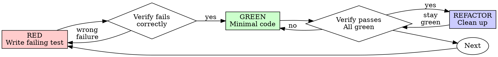

# 测试驱动开发（TDD）

## 概述

先写测试，看着它失败，再写让它通过的最小代码。

**核心原则：**如果没有亲眼看到测试失败，就不知道它是否测试了正确的东西。

**违反规则的字面要求，也就是违反规则的精神。**

## 使用时机

**始终用于：**

- 新功能
- Bug 修复
- 重构
- 行为变更

**例外（询问人类协作者）：**

- 可丢弃原型
- 生成代码
- 配置文件

在想“这次跳过 TDD”？停止。这是在找借口。

## 铁律

```
没有先写失败测试，就不能写生产代码
```

先写了代码？删除它，重新开始。

**没有例外：**

- 不要保留为“参考”
- 不要在写测试时“适配”它
- 不要查看它
- 删除就是删除

完全根据测试重新实现。就这样。

## RED-GREEN-REFACTOR



### RED——编写失败测试

写一个最小测试，展示应该发生什么。

<Good>

```typescript
test('retries failed operations 3 times', async () => {
  let attempts = 0;
  const operation = () => {
    attempts++;
    if (attempts < 3) throw new Error('fail');
    return 'success';
  };

  const result = await retryOperation(operation);

  expect(result).toBe('success');
  expect(attempts).toBe(3);
});
```

名称清晰，测试真实行为，只测一件事。
</Good>

<Bad>

```typescript
test('retry works', async () => {
  const mock = jest.fn()
    .mockRejectedValueOnce(new Error())
    .mockRejectedValueOnce(new Error())
    .mockResolvedValueOnce('success');
  await retryOperation(mock);
  expect(mock).toHaveBeenCalledTimes(3);
});
```

名称模糊，测试的是 mock 而不是代码。
</Bad>

**要求：**

- 一个行为
- 清晰名称
- 真实代码（除非无法避免，否则不用 mock）

### 验证 RED——看着它失败

**必须执行，绝不跳过。**

```bash
npm test path/to/test.test.ts
```

确认：

- 测试失败（不是执行错误）
- 失败消息符合预期
- 因功能缺失而失败（不是拼写错误）

**测试通过？**你测试的是现有行为。修正测试。

**测试报错？**修复错误并重跑，直到正确失败。

### GREEN——最小代码

编写能让测试通过的最简单代码。

<Good>

```typescript
async function retryOperation<T>(fn: () => Promise<T>): Promise<T> {
  for (let i = 0; i < 3; i++) {
    try {
      return await fn();
    } catch (e) {
      if (i === 2) throw e;
    }
  }
  throw new Error('unreachable');
}
```

刚好足以通过。
</Good>

<Bad>

```typescript
async function retryOperation<T>(
  fn: () => Promise<T>,
  options?: {
    maxRetries?: number;
    backoff?: 'linear' | 'exponential';
    onRetry?: (attempt: number) => void;
  }
): Promise<T> {
  // YAGNI
}
```

过度设计。
</Bad>

不要增加功能、重构其他代码，或做出超出测试要求的“改进”。

### 验证 GREEN——看着它通过

**必须执行。**

```bash
npm test path/to/test.test.ts
```

确认：

- 测试通过
- 其他测试仍然通过
- 输出干净（没有错误和警告）

**测试失败？**修复代码，不要改测试。

**其他测试失败？**立即修复。

**“其他测试”指项目完整套件，不只是你的文件。**新写测试变绿，不代表整个套件变绿。声称变更完成前，运行项目测试命令（裸 `pytest`、`npm test`、`cargo test`，或仓库采用的其他命令），即使任务只点名一个测试文件。任务范围限制的是交付物，不是验证范围。该命令显示的任何失败——包括不是你引起的失败——都必须按名称写入报告；看到失败却未在报告中说明，会让报告失真。

### REFACTOR——清理

只在绿色后进行：

- 删除重复
- 改进命名
- 提取辅助函数

保持测试绿色，不要增加行为。

### 重复

为下一项功能编写下一个失败测试。

## 优秀测试

| 质量 | 好 | 差 |
|---------|------|-----|
| **最小** | 一件事。名称中有 “and”？拆开。 | `test('validates email and domain and whitespace')` |
| **清晰** | 名称描述行为 | `test('test1')` |
| **展示意图** | 演示理想 API | 掩盖代码应做什么 |

编写或修改任何测试时，阅读 [writing-good-tests.md](writing-good-tests.md)，遵循其中保证测试诚实的规则：

- 写测试前，先指出哪项生产变更会让该测试失败
- 断言真实行为，绝不断言 mock 行为
- 测试专用代码放在测试工具中，不要放进生产类
- mock 依赖前先理解其副作用

## 常见借口

| 借口 | 事实 |
|---------|---------|
| “太简单，不需要测试” | 简单代码也会坏，测试只需 30 秒。 |
| “之后再测” | 实现后写的测试会立即通过——这什么也证明不了。它可能测试错误内容、测试实现而非行为，或漏掉你忘记的边界情况。你从未看到它失败，就没有证明它能捕获 bug。测试优先会强制产生这次失败。 |
| “后补测试能达到相同目标（重精神，不重仪式）” | 后补测试回答“这段代码做什么”；测试优先回答“它应该做什么”。后补测试受现有代码偏见影响——只验证你记得的情况，而不是本可以发现的情况。只有覆盖率，没有测试有效的证据。 |
| “已经手工测试过” | 手工测试是临时的：没有覆盖记录，代码变化后无法重复，压力下很容易忘记情况。“我试过一次能工作”不等于完整验证。自动测试每次以相同方式运行。 |
| “删除已经花费 X 小时的代码太浪费” | 这是沉没成本谬误——时间无论如何已经花掉。真正的选择是：用 TDD 重写（高信心），或保留代码再补测试（低信心、很可能有 bug）。保留无法信任的代码才是浪费。 |
| “保留作参考，再先写测试” | 你会适配它，这就是后补测试。删除就是删除。 |
| “需要先探索” | 可以。探索结束后丢弃，再从 TDD 开始。 |
| “难以测试 = 设计不清楚” | 听测试的。难测试就意味着难使用。 |
| “TDD 会拖慢我” | TDD 才是务实路径：提交前捕获 bug、防止回归、让重构不再可怕。“务实”捷径会让你在生产环境调试——更慢。 |
| “手工测试更快” | 手工测试不能证明边界情况，每次变更都得重测。 |
| “现有代码没有测试” | 你正在改进它。为现有代码添加测试。 |

## 危险信号——停止并重新开始

- 测试前写代码
- 实现后写测试
- 测试立即通过
- 无法解释测试为何失败
- 以后再加测试
- 用“只此一次”找借口
- “我已经手工测过”
- “后补测试目的相同”
- “重精神，不重仪式”
- “保留作参考”或“适配现有代码”
- “已经花了 X 小时，删除太浪费”
- “TDD 太教条，我只是务实”
- “这次情况不同，因为……”

**这些全都意味着：删除代码，从 TDD 重新开始。**

## 示例：Bug 修复

**Bug：**接受空 email。

**RED**

```typescript
test('rejects empty email', async () => {
  const result = await submitForm({ email: '' });
  expect(result.error).toBe('Email required');
});
```

**验证 RED**

```bash
$ npm test
FAIL: expected 'Email required', got undefined
```

**GREEN**

```typescript
function submitForm(data: FormData) {
  if (!data.email?.trim()) {
    return { error: 'Email required' };
  }
  // ...
}
```

**验证 GREEN**

```bash
$ npm test
PASS
```

**REFACTOR**

需要时提取多字段验证。

## 验证清单

把工作标为完成前：

- [ ] 每个新函数或方法都有测试
- [ ] 实现前看到每项测试失败
- [ ] 每项测试因预期原因失败（功能缺失，而不是拼写错误）
- [ ] 只写让测试通过的最小代码
- [ ] 所有测试通过
- [ ] 输出干净（没有错误和警告）
- [ ] 测试使用真实代码（只有无法避免时才 mock）
- [ ] 覆盖边界情况和错误

无法勾选全部项目？你跳过了 TDD。重新开始。

## 卡住时

| 问题 | 解决办法 |
|---------|----------|
| 不知道如何测试 | 先写理想 API，再写断言。询问人类协作者。 |
| 测试太复杂 | 设计太复杂。简化接口。 |
| 必须 mock 一切 | 代码耦合过高。使用依赖注入。 |
| 测试设置庞大 | 提取辅助函数。仍然复杂？简化设计。 |

## 调试集成

发现 bug？编写能复现它的失败测试，遵循 TDD 循环。测试既证明修复，又防止回归。

绝不要在没有测试的情况下修复 bug。

## 最终规则

```
生产代码 → 测试存在且先失败
否则 → 不算 TDD
```

未经人类协作者允许，没有例外。
