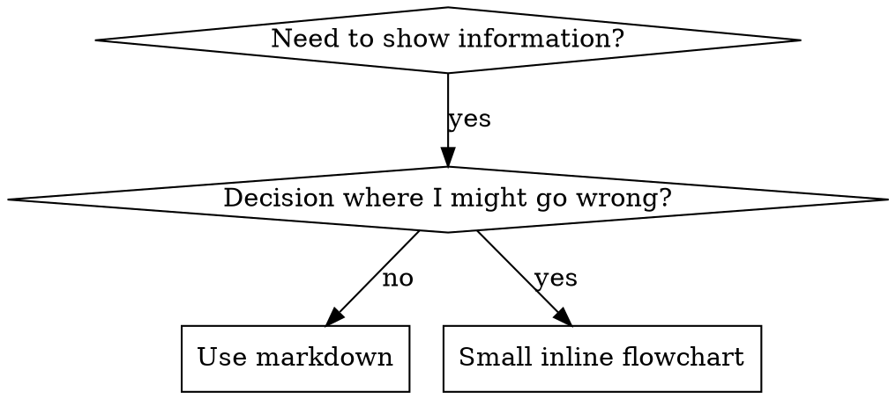

# 编写技能

## 概述

**编写技能，就是把测试驱动开发应用到流程文档。**

**个人技能位于运行环境的 skills 目录**（Claude Code 中为 `~/.claude/skills/`）。Codex 和 Gemini 的路径见 [codex-tools.md](../using-superpowers/references/codex-tools.md) 与 [gemini-tools.md](../using-superpowers/references/gemini-tools.md)。Codex、Copilot CLI 和 Gemini CLI 也都识别跨运行时别名 `~/.agents/skills/`。

先编写测试用例（对子 Agent 施压的场景），观察它们失败（基线行为），再编写技能（文档），观察测试通过（Agent 遵从），最后重构（堵住漏洞）。

**核心原则：**如果没有观察 Agent 在缺少技能时失败，就不知道技能是否教对了内容。

**必需背景：**使用本技能前必须理解 `superpowers:test-driven-development`。它定义基础 RED-GREEN-REFACTOR 循环；本技能把 TDD 适配到文档。

**官方指导：**Anthropic 官方技能编写最佳实践见 `anthropic-best-practices.md`。本文提供额外模式和指南，补充以 TDD 为中心的方法。

## 什么是技能？

**技能**是经过验证的技巧、模式或工具的参考指南，帮助未来 Agent 找到并应用有效方法。

**技能是：**可复用技巧、模式、工具和参考指南。

**技能不是：**讲述你曾经如何解决某个问题的故事。

## 技能的 TDD 映射

| TDD 概念 | 技能创建 |
|-------------|----------------|
| **测试用例** | 对子 Agent 施压的场景 |
| **生产代码** | 技能文档（SKILL.md） |
| **测试失败（RED）** | 没有技能时 Agent 违反规则（基线） |
| **测试通过（GREEN）** | 提供技能后 Agent 遵从 |
| **重构** | 在保持遵从的同时堵住漏洞 |
| **先写测试** | 编写技能前运行基线场景 |
| **观察失败** | 逐字记录 Agent 使用的借口 |
| **最小代码** | 只针对已观察违规编写技能 |
| **观察通过** | 验证 Agent 现在遵从 |
| **重构循环** | 找到新借口 → 堵住 → 重新验证 |

整个技能创建过程都遵循 RED-GREEN-REFACTOR。

## 何时创建技能

**以下情况创建：**

- 技巧对你而言并非直觉可见
- 你会在不同项目中再次引用
- 模式适用范围广，而不是项目特有
- 其他人也会受益

**以下情况不要创建：**

- 一次性解决方案
- 其他地方已有良好文档的标准做法
- 项目特有约定（放进项目指令文件）
- 机械约束（若能用正则或验证器强制，就自动化；文档留给需要判断的内容）

## 技能类型

### 技巧

包含明确步骤的具体方法，例如 condition-based-waiting、root-cause-tracing。

### 模式

思考问题的方式，例如 flatten-with-flags、test-invariants。

### 参考

API 文档、语法指南和工具文档，例如 office docs。

## 目录结构

```
skills/
  skill-name/
    SKILL.md              # 主参考文件（必需）
    supporting-file.*     # 仅在需要时添加
```

**平铺命名空间**——所有技能位于同一个可搜索命名空间。

**以下内容拆成单独文件：**

1. **大型参考**（100 行以上）——API 文档、完整语法
2. **可复用工具**——脚本、实用工具、模板

**以下内容保持内联：**

- 原则和概念
- 代码模式（少于 50 行）
- 其他所有内容

## SKILL.md 结构

**Frontmatter（YAML）：**

- 两个必需字段：`name` 和 `description`（全部支持字段见 [agentskills.io/specification](https://agentskills.io/specification)）
- 总长最多 1024 字符
- `name`：只能使用字母、数字和连字符（不能有括号或特殊字符）
- `description`：使用第三人称，**只描述何时使用**，不描述技能做什么
  - 以 “Use when...” 开头，聚焦触发条件
  - 包含具体症状、情况和上下文
  - **绝不概述技能流程或工作流**（原因见 SDO）
  - 尽量保持在 500 字符以内

```markdown
---
name: Skill-Name-With-Hyphens
description: Use when [specific triggering conditions and symptoms]
---

# Skill Name

## Overview
这是什么？用 1–2 句话给出核心原则。

## When to Use
[只有决策不明显时才使用小型内联流程图]

列出症状和使用场景
列出何时不应使用

## Core Pattern (for techniques/patterns)
修改前后代码对比

## Quick Reference
便于扫描常用操作的表格或列表

## Implementation
简单模式使用内联代码
大型参考或可复用工具链接到单独文件

## Common Mistakes
常见错误和修复方式

## Real-World Impact (optional)
具体结果
```

## 技能发现优化（SDO）

**发现能力至关重要：**未来 Agent 必须能找到技能。

### 1. 丰富的 Description 字段

**目的：**Agent 通过 description 判断面对任务时应加载哪些技能。它必须回答：“我现在是否应阅读这项技能？”

**格式：**以 “Use when...” 开头，聚焦触发条件。

**关键：Description = 何时使用，不是技能做什么。**

description 只能描述触发条件，不得概述技能流程或工作流。

**为何重要：**测试表明，description 概述工作流时，Agent 可能直接照 description 行动，而不阅读完整技能。曾有 description 写着“在任务之间做代码评审”，Agent 因而只做了一次评审，虽然技能流程图明确要求先规格评审、再代码质量评审两次。

将 description 改为纯触发条件 “Use when executing implementation plans with independent tasks” 后，Agent 正确阅读流程图并遵循两阶段评审。

**陷阱：**概述工作流的 description 会成为 Agent 采用的捷径，技能正文变成被跳过的文档。

```yaml
# ❌ 差：概述工作流——Agent 可能照此执行而不读技能
description: Use when executing plans - dispatches subagent per task with code review between tasks

# ❌ 差：流程细节过多
description: Use for TDD - write test first, watch it fail, write minimal code, refactor

# ✅ 好：只有触发条件，没有流程摘要
description: Use when executing implementation plans with independent tasks in the current session

# ✅ 好：只有触发条件
description: Use when implementing any feature or bugfix, before writing implementation code
```

**内容要求：**

- 使用表明技能适用的具体触发条件、症状和场景
- 描述**问题**（竞态条件、行为不一致），而不是语言特有症状（setTimeout、sleep）
- 除非技能本身限定技术，否则触发条件应与技术无关
- 技术限定技能要在触发条件中明确说明
- 使用第三人称（内容会注入系统提示）
- **绝不概述流程或工作流**

```yaml
# ❌ 差：太抽象、模糊，没有说明何时使用
description: For async testing

# ❌ 差：第一人称
description: I can help you with async tests when they're flaky

# ❌ 差：提到技术，但技能并不限定该技术
description: Use when tests use setTimeout/sleep and are flaky

# ✅ 好：以 Use when 开头，描述问题，不概述流程
description: Use when tests have race conditions, timing dependencies, or pass/fail inconsistently

# ✅ 好：技术限定技能有明确触发条件
description: Use when using React Router and handling authentication redirects
```

### 2. 关键词覆盖

使用 Agent 会搜索的词：

- 错误消息：“Hook timed out”“ENOTEMPTY”“race condition”
- 症状：“flaky”“hanging”“zombie”“pollution”
- 同义词：“timeout/hang/freeze”“cleanup/teardown/afterEach”
- 工具：真实命令、库名和文件类型

### 3. 描述性命名

**使用主动语态，动词优先：**

- ✅ `creating-skills`，不要 `skill-creation`
- ✅ `condition-based-waiting`，不要 `async-test-helpers`

### 4. Token 效率（关键）

**问题：**getting-started 和高频引用技能会加载进**每次**对话，每个 token 都有成本。

**目标词数：**

- getting-started 工作流：每个少于 150 词
- 高频加载技能：总计少于 200 词
- 其他技能：少于 500 词（仍要简洁）

**技巧：**

**把细节移到工具帮助：**

```bash
# ❌ 差：在 SKILL.md 中列出全部选项
search-conversations supports --text, --both, --after DATE, --before DATE, --limit N

# ✅ 好：引用 --help
search-conversations supports multiple modes and filters. Run --help for details.
```

**使用交叉引用：**

```markdown
# ❌ 差：重复工作流细节
When searching, dispatch subagent with template...
[20 行重复说明]

# ✅ 好：引用其他技能
Always use subagents (50-100x context savings). REQUIRED: Use [other-skill-name] for workflow.
```

**压缩示例：**

```markdown
# ❌ 差：冗长示例（42 词）
your human partner: "How did we handle authentication errors in React Router before?"
You: I'll search past conversations for React Router authentication patterns.
[Dispatch subagent with search query: "React Router authentication error handling 401"]

# ✅ 好：最小示例（20 词）
Partner: "How did we handle auth errors in React Router?"
You: Searching...
[Dispatch subagent → synthesis]
```

**消除冗余：**

- 不重复交叉引用技能中的内容
- 不解释命令已经明显表达的行为
- 不给同一种模式提供多个示例

**验证：**

```bash
wc -w skills/path/SKILL.md
# getting-started workflows: aim for <150 each
# Other frequently-loaded: aim for <200 total
```

**按动作或核心洞见命名：**

- ✅ `condition-based-waiting` > `async-test-helpers`
- ✅ `using-skills`，不要 `skill-usage`
- ✅ `flatten-with-flags` > `data-structure-refactoring`
- ✅ `root-cause-tracing` > `debugging-techniques`

**动名词（-ing）很适合流程：**

- `creating-skills`、`testing-skills`、`debugging-with-logs`
- 主动，直接描述正在进行的动作

### 5. 交叉引用其他技能

文档引用其他技能时，只写技能名，并加明确要求标记：

- ✅ `**REQUIRED SUB-SKILL:** Use superpowers:test-driven-development`
- ✅ `**REQUIRED BACKGROUND:** You MUST understand superpowers:systematic-debugging`
- ❌ `See skills/testing/test-driven-development`（不清楚是否必需）
- ❌ `@skills/testing/test-driven-development/SKILL.md`（强制加载，浪费上下文）

**为何不用 @ 链接：**`@` 语法会立刻强制加载文件，在真正需要前就消耗 200k 以上上下文。

## 流程图使用方式



**只在以下情况使用流程图：**

- 不明显的决策点
- 可能过早停止的流程循环
- “何时用 A、何时用 B”的判断

**以下情况绝不使用流程图：**

- 参考资料 → 使用表格和列表
- 代码示例 → 使用 Markdown 代码块
- 线性说明 → 使用编号列表
- 没有语义的标签（step1、helper2）

Graphviz 样式规则见本目录 `graphviz-conventions.dot`。

**向人类协作者可视化：**使用本目录 `render-graphs.js` 把技能流程图渲染为 SVG：

```bash
node ./render-graphs.js ../some-skill           # 每张图单独输出
node ./render-graphs.js ../some-skill --combine # 所有图合并成一个 SVG
```

## 代码示例

**一个优秀示例胜过多个平庸示例。**

选择最相关的语言：

- 测试技巧 → TypeScript/JavaScript
- 系统调试 → Shell/Python
- 数据处理 → Python

**好示例应当：**

- 完整且可运行
- 注释清楚说明**为什么**
- 来自真实场景
- 清晰展示模式
- 可直接适配，而不是泛化模板

**不要：**

- 用 5 种以上语言实现
- 创建填空模板
- 编写刻意制造的示例

你擅长移植，一个优秀示例就足够。

## 文件组织

### 自包含技能

```
defense-in-depth/
  SKILL.md    # 全部内容内联
```

适用：全部内容都放得下，不需要大型参考。

### 带可复用工具的技能

```
condition-based-waiting/
  SKILL.md    # 概述与模式
  example.ts  # 可供适配的工作辅助代码
```

适用：工具是可复用代码，而不只是文字说明。

### 带大型参考的技能

```
pptx/
  SKILL.md       # 概述与工作流
  pptxgenjs.md   # 600 行 API 参考
  ooxml.md       # 500 行 XML 结构
  scripts/       # 可执行工具
```

适用：参考材料太大，不适合内联。

在正文中通过解释器调用随附脚本（`bash scripts/tool.sh`、`node scripts/tool.js`），绝不要直接写裸路径：某些运行环境插件打包器会去掉可执行位，裸执行 `scripts/tool.sh` 会报 `Permission denied`。

## 铁律（与 TDD 相同）

```
没有先写失败测试，就不能编写技能
```

该规则适用于新技能，也适用于修改现有技能。

测试前写了技能？删除并重新开始。没有测试就修改技能？同样违规。

**没有例外：**

- “简单添加”也不例外
- “只增加一节”也不例外
- “文档更新”也不例外
- 不得把未经测试的变更保留为“参考”
- 不得在运行测试时“适配”它
- 删除就是删除

**必需背景：**`superpowers:test-driven-development` 解释了为何如此。相同原则适用于文档。

## 测试所有技能类型

不同类型需要不同测试方式。

### 纪律约束型技能（规则和要求）

**示例：**TDD、verification-before-completion、先设计后编码。

**测试方法：**

- 学术问题：是否理解规则？
- 压力场景：压力下是否遵从？
- 组合压力：时间 + 沉没成本 + 疲惫
- 识别借口，并添加明确反驳

**成功标准：**Agent 在最大压力下仍遵循规则。

### 技巧型技能（操作指南）

**示例：**condition-based-waiting、root-cause-tracing、defensive-programming。

**测试方法：**

- 应用场景：能否正确应用技巧？
- 变化场景：能否处理边界情况？
- 缺失信息测试：指令是否有缺口？

**成功标准：**Agent 能把技巧应用到新场景。

### 模式型技能（思维模型）

**示例：**reducing-complexity、information-hiding 概念。

**测试方法：**

- 识别场景：能否识别模式适用时机？
- 应用场景：能否使用该思维模型？
- 反例：是否知道何时不应使用？

**成功标准：**Agent 正确识别何时以及如何应用模式。

### 参考型技能（文档和 API）

**示例：**API 文档、命令参考、库指南。

**测试方法：**

- 检索场景：能否找到正确信息？
- 应用场景：能否正确使用找到的信息？
- 缺口测试：是否覆盖常见用例？

**成功标准：**Agent 找到并正确应用参考信息。

## 跳过测试的常见借口

| 借口 | 事实 |
|--------|---------|
| “技能显然很清楚” | 对你清楚不等于对其他 Agent 清楚。测试。 |
| “这只是参考” | 参考也可能有缺口和模糊段落。测试检索。 |
| “测试太重了” | 未测试技能一定有问题。15 分钟测试能节省数小时。 |
| “出问题再测” | 出问题就意味着 Agent 已无法使用技能。部署前测试。 |
| “测试太乏味” | 测试比在生产中调试坏技能轻松。 |
| “我有信心” | 过度自信必然留下问题。仍要测试。 |
| “阅读评审就够了” | 阅读不等于使用。测试应用场景。 |
| “没时间测试” | 部署未测试技能后再修复会浪费更多时间。 |

**以上都意味着：部署前测试，没有例外。**

## 让指导形式匹配失败类型

编写指导前，先给基线失败分类。能防住一种失败的形式，可能明显恶化另一种失败。

| 基线失败 | 正确形式 | 错误形式 |
|---|---|---|
| 压力下跳过或违反规则（明知故犯） | 禁令 + 借口表 + 危险信号 | 温和建议（“优先”“考虑”） |
| 遵从规则，但输出形状错误（提示膨胀、结论埋没、重复规格） | 正向配方或契约：按顺序说明输出**是什么** | 禁止列表（“不要复述”“绝不叙述”） |
| 从已经产出的内容中遗漏必需元素 | 结构化：在模板中设置 REQUIRED 字段或槽位 | 模板附近的文字提醒 |
| 行为应取决于条件 | 以可观察谓词为键的条件句（“如果简报存在，就引用它”） | 无条件规则加豁免条款 |

**为何禁令会恶化形状问题：**面对竞争动机（例如“让提示自包含”）时，Agent 会与“不要 X”讨价还价。对派遣提示指导的对照措辞测试中，禁令组明显产出更多不想要内容，甚至比无指导对照更差；应微测自己的场景，但不要默认使用禁令。配方没有协商空间：输出要么符合形状，要么不符合。

**无论选择哪种形式，都遵循：**

- **不要添加模糊例外。**“除非有必要，否则不要 X”会重新打开协商。测试表明，在获胜配方后加一条含糊例外，会让稳定结果变得嘈杂。真实例外应成为以可观察条件为键的独立条件。
- **豁免条款无法限定作用域。**“代码块不受此限制”仍可能压制代码块。若某部分必须豁免，重构规则，使其根本无法触达该部分。

## 防止 Agent 为纪律型技能找借口

TDD 等纪律技能需要抵抗压力下的合理化。Agent 很聪明，会寻找漏洞。

**范围：**这套工具只用于纪律失败——Agent 知道规则，却在压力下跳过。输出形状错误或元素遗漏时，基于禁令的防护会适得其反，应使用上一节的形式。

**心理学说明：**理解说服原则为何有效，才能系统应用。研究基础见 `persuasion-principles.md`（Cialdini, 2021；Meincke 等，2025），涵盖权威、承诺、稀缺、社会证明和一致性原则。

### 明确堵住每个漏洞

不要只陈述规则，要禁止具体绕法：

<Bad>

```markdown
Write code before test? Delete it.
```

</Bad>

<Good>

```markdown
Write code before test? Delete it. Start over.

**No exceptions:**
- Don't keep it as "reference"
- Don't "adapt" it while writing tests
- Don't look at it
- Delete means delete
```

</Good>

### 回应“精神与字面”争论

尽早写入基础原则：

```markdown
**Violating the letter of the rules is violating the spirit of the rules.**
```

这会截断整个“我遵循的是精神”借口类别。

### 建立借口表

从基线测试收集借口。Agent 给出的每个理由都进入表格：

```markdown
| Excuse | Reality |
|--------|---------|
| "Too simple to test" | Simple code breaks. Test takes 30 seconds. |
| "I'll test after" | Tests passing immediately prove nothing. |
| "Tests after achieve same goals" | Tests-after = "what does this do?" Tests-first = "what should this do?" |
```

### 创建危险信号列表

让 Agent 容易发现自己正在找借口：

```markdown
## Red Flags - STOP and Start Over

- Code before test
- "I already manually tested it"
- "Tests after achieve the same purpose"
- "It's about spirit not ritual"
- "This is different because..."

**All of these mean: Delete code. Start over with TDD.**
```

### 为违规症状更新 SDO

在 description 中加入即将违规时的症状：

```yaml
description: use when implementing any feature or bugfix, before writing implementation code
```

## 技能的 RED-GREEN-REFACTOR

遵循 TDD 循环。

### RED：编写失败测试（基线）

让子 Agent 在**没有技能**时运行压力场景，逐字记录：

- 作出了哪些选择？
- 使用了什么借口？
- 哪些压力触发违规？

这就是“观察测试失败”——编写技能前必须看到 Agent 的自然行为。

### GREEN：编写最小技能

只编写针对已观察借口的内容，不为假设场景添加额外材料。

提供技能后运行相同场景，Agent 现在应当遵从。

### REFACTOR：堵住漏洞

Agent 找到新借口？添加明确反驳。重新测试直到没有漏洞。

### 在完整场景前微测措辞

完整压力场景是最终门禁，但每轮慢且昂贵。先验证措辞本身：

1. **每次调用一个全新上下文样本**——原始 API 调用，或没有 API 时使用单次子 Agent。系统提示必须是指导实际所在的真实上下文（完整技能或提示模板，而不是孤立片段）；用户消息应诱发目标失败。
2. **始终包含无指导对照。**如果对照不出现失败，就没有需要修复的内容——停止，不要编写指导。
3. **每个变体至少 5 次重复。**单个样本并不可靠。
4. **手工阅读每个标记匹配。**可以程序计分，但模板回显和引用反例会伪装成命中；只靠自动计数会同时夸大失败和成功。
5. **方差也是指标。**指导生效后，重复结果应收敛为相同形状。5 次出现 5 种理解说明措辞没有约束力；先收紧形式，不要只增加文字。

微测验证措辞，不能代替纪律技能的压力场景。

完整测试方法见 [testing-skills-with-subagents.md](testing-skills-with-subagents.md)：

- 如何编写压力场景
- 压力类型（时间、沉没成本、权威、疲惫）
- 如何系统堵住漏洞
- 元测试技巧

## 反模式

### ❌ 叙事示例

“在 2025-10-03 会话中，我们发现空 projectDir 导致……”

**问题：**过于具体，无法复用。

### ❌ 多语言稀释

`example-js.js`、`example-py.py`、`example-go.go`

**问题：**质量平庸，维护负担大。

### ❌ 在流程图中写代码

```dot
step1 [label="import fs"];
step2 [label="read file"];
```

**问题：**无法复制粘贴，难以阅读。

### ❌ 通用标签

`helper1`、`helper2`、`step3`、`pattern4`

**问题：**标签应具有语义。

## 停止：进入下一技能前

**编写任何技能后，必须停止并完成部署过程。**

**不要：**

- 批量创建多个技能，却不逐个测试
- 当前技能尚未验证就进入下一项
- 因“批处理效率更高”而跳过测试

下面的部署清单对**每项技能**都是强制要求。

部署未经测试的技能等于部署未经测试的代码，违反质量标准。

## 技能创建清单（TDD 适配版）

**重要：为以下每个检查项创建一个 todo。**

**RED 阶段——编写失败测试：**

- [ ] 创建压力场景（纪律技能组合 3 种以上压力）
- [ ] 在没有技能时运行场景，逐字记录基线行为
- [ ] 识别借口或失败模式

**GREEN 阶段——编写最小技能：**

- [ ] 名称只含字母、数字和连字符
- [ ] YAML frontmatter 含必需 `name` 和 `description`（总计最多 1024 字符；见[规范](https://agentskills.io/specification)）
- [ ] Description 以 “Use when...” 开头并含具体触发条件或症状
- [ ] Description 使用第三人称
- [ ] 全文包含便于搜索的错误、症状和工具关键词
- [ ] 概述清晰并包含核心原则
- [ ] 处理 RED 阶段发现的具体基线失败
- [ ] 指导形式与失败类型匹配
- [ ] 对塑造行为的指导，以无指导对照做过 5 次以上措辞微测，并手工阅读每个标记匹配；纯参考技能不适用
- [ ] 代码内联或链接单独文件
- [ ] 提供一个优秀示例，不做多语言稀释
- [ ] 提供技能后运行场景，验证 Agent 现在遵从

**REFACTOR 阶段——堵住漏洞：**

- [ ] 识别测试中出现的新借口
- [ ] 纪律技能添加明确反驳
- [ ] 根据全部测试迭代建立借口表
- [ ] 创建危险信号列表
- [ ] 重测直到没有漏洞

**质量检查：**

- [ ] 只有决策不明显时才使用小流程图
- [ ] 快速参考表
- [ ] 常见错误章节
- [ ] 没有叙事故事
- [ ] 支撑文件只用于工具或大型参考

**部署：**

- [ ] 提交技能到 Git；若已配置 fork，推送到 fork
- [ ] 若适用范围广，考虑通过 PR 回馈上游

## 发现工作流

未来 Agent 通过以下流程找到技能：

1. **遇到问题**（“测试不稳定”）
2. **搜索技能**（搜索 description、浏览类别）
3. **找到 SKILL**（description 匹配）
4. **扫描概述**（是否相关？）
5. **阅读模式**（快速参考表）
6. **加载示例**（仅在实现时）

**围绕此流程优化**——尽早并反复出现可搜索词。
